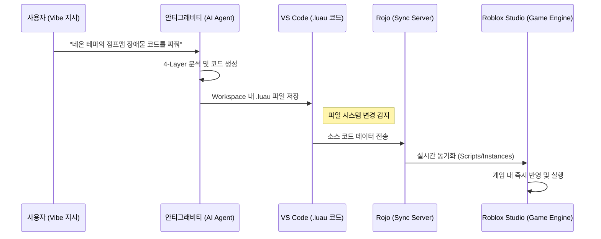

> **Original User Prompt**: "연결 흐름이 안티그래비티 -> vs code -> 로블록스 스튜디오 이렇게 연결되는거야?"

# 103_로블록스-AI(안티그래비티) 연결 아키텍처 가이드

## 1. 개요
사용자께서 질문하신 **"안티그래비티 -> VS Code -> 로블록스 스튜디오"** 연결 흐름은 정확합니다. 이 흐름이 어떻게 기술적으로 맞물려 '바이브 코딩'을 가능하게 하는지 상세 아키텍처를 설명합니다.

## 2. 연결 흐름도 (Sequence Diagram)

## 3. 각 단계별 핵심 역할 및 연동 방식

### [1단계] 안티그래비티 -> VS Code
*   **연결 방식**: 안티그래비티는 사용자의 맥북 파일 시스템(Workspace)에 직접 접근할 수 있는 권한을 가집니다.
*   **작동**: 안티그래비티가 생성한 Luau 스크립트와 프로젝트 설정 파일(default.project.json)이 VS Code 프로젝트 폴더에 저장됩니다.

### [2단계] VS Code -> Rojo (Sync Server)
*   **연결 방식**: VS Code의 Rojo 확장 프로그램이 프로젝트 폴더의 변경 사항을 실시간으로 감시합니다.
*   **작동**: 텍스트 형태의 스크립트 파일이 로블록스가 이해할 수 있는 바이너리/객체 데이터로 변환되어 메모리 상의 서버로 올라갑니다.

### [3단계] Rojo -> 로블록스 스튜디오
*   **연결 방식**: 로블록스 스튜디오 내부에 설치된 'Rojo Plugin'이 외부 Rojo 서버와 HTTP/WebSocket으로 연결됩니다.
*   **작동**: VS Code에서 저장된 코드가 로블록스 스튜디오의 `Explorer` 창에 있는 스크립트 객체로 즉시 덮어씌워집니다.

## 4. MCP(Model Context Protocol)가 추가되는 이유
질문하신 흐름에 **MCP**가 추가되면 다음과 같은 강력한 기능이 가능해집니다:
*   **양방향 소통**: 기존에는 안티그래비티가 코드를 '보내기만' 했다면, MCP를 통하면 안티그래비티가 **"현재 로블록스 스튜디오 안에 어떤 오브젝트들이 배치되어 있는지"**를 역으로 읽어올 수 있습니다.
*   **컨텍스트 이해**: "저번에 만든 빨간색 공 오브젝트 옆에 발판을 만들어줘"와 같은 명령이 가능해집니다.

## 5. 결론
네, 맞습니다. 안티그래비티는 **'두뇌'** 역할을 하고, VS Code는 **'작업대'**, 로블록스 스튜디오는 **'최종 결과물이 구현되는 무대'**가 됩니다. 이 세 가지가 Rojo라는 **'통로'**를 통해 하나로 연결되는 구조입니다.

**Antigravity System V3.0 Operational.**
