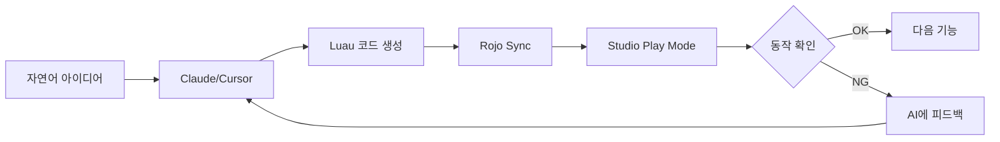

# 200_로블록스_개발방법론_조사분석_보고서

> **조사일**: 2026-01-25
> **조사 범위**: 해외 개발사례, DevForum, 학술논문, Vibe Coding, 실전 경험
> **목적**: 바이브코딩 기반 로블록스 개발에 최적화된 방법론 수립을 위한 기초 조사

---

## 📋 Executive Summary

본 보고서는 로블록스 게임 개발에서 **AI 코딩 보조(Vibe Coding)**를 활용한 최신 개발 방법론을 조사·분석한 결과입니다.

### 핵심 발견사항

| 영역 | 핵심 인사이트 |
|:---|:---|
| **해외 워크플로우** | Rojo + Git + CI/CD가 프로 표준, AI 통합 가속화 |
| **Vibe Coding** | Claude/Cursor → 자연어 지시 → AI 코드 생성 → 결과 확인 (코드 리뷰 최소화) |
| **테스트** | TestEZ (BDD) 권장, 변이 테스트는 미지원 (수동 검증) |
| **프레임워크** | Knit (archived), 현재는 순수 ModuleScript + DI 패턴 권장 |
| **학술 연구** | 교육용 효과 입증, STEM 학습 도구로 인정 |
| **실전 경험** | Ansible Jump 001: 4.5시간 만에 런칭 성공 (Rojo + Python 자동화) |

---

## 1. 해외 프로페셔널 개발 워크플로우

### 1.1 표준 도구 스택

| 도구 | 역할 | 채택률 |
|:---|:---|:---:|
| **Rojo 7.6+** | Studio ↔ 파일시스템 동기화 | 필수 |
| **VSCode** | 외부 IDE (코드 편집) | 필수 |
| **Git/GitHub** | 버전 관리, 브랜칭, PR, 코드 리뷰 | 필수 |
| **Selene** | 정적 분석 (Linter) | 권장 |
| **StyLua** | 코드 포매터 | 권장 |
| **Wally** | 패키지 매니저 | 선택 |
| **Foreman** | 도구 체인 관리 | 선택 |
| **Roblox LSP** | 자동 완성, 타입 체크 | 권장 |

### 1.2 프로페셔널 개발 프로세스 (5단계)

```
1. Discovery & Requirement (발견 및 요구사항 정의)
   └─ 게임 컨셉, 타겟 사용자, 핵심 메카닉 정의

2. Planning & Prototyping (기획 및 프로토타이핑)
   └─ 핵심 게임플레이 프로토타입 제작 (시각 미학보다 메카닉 우선)

3. Full Development (본격 개발)
   └─ 에셋 제작, 스크립팅, 게임플레이 정교화

4. QA & Iteration (품질 보증 및 반복)
   └─ 버그 식별, 테스트, 개선

5. Launch & Publishing (런칭 및 퍼블리싱)
   └─ Roblox 플랫폼에 배포
```

### 1.3 팀 협업 Best Practices

> **핵심 원칙**: Rojo는 **스크립트 전용**, 3D 에셋은 **Studio Team Create** 분리

- **브랜칭 전략**: 개발자별 feature 브랜치 → PR → 코드 리뷰 → main 병합
- **분리된 개발 Place**: 각 개발자 전용 Studio 파일에서 작업 후 병합
- **Partially Managed Rojo**: 스크립트만 Rojo, 모델/UI는 Studio 직접 관리
- **커뮤니케이션**: Discord/Slack 채널, Trello/Asana 태스크 관리

### 1.4 코딩 스타일 가이드

- **camelCase** 변수명
- **ModuleScript** 활용한 모듈화
- **Guard Clauses** (조기 반환)
- **Game:GetService()** 사용 (직접 참조 지양)
- **함수형 프로그래밍** 원칙 적용

---

## 2. AI 보조 개발 (Vibe Coding)

### 2.1 Vibe Coding 정의

> **Andrej Karpathy (2025)**: "자연어로 프로젝트를 설명하면 LLM이 코드를 생성하고, 인간은 결과를 평가하되 코드를 한 줄씩 리뷰하지 않는 개발 방식"

**핵심 원칙**:
1. **Code First, Refine Later**: 빠른 프로토타이핑 우선
2. **결과 평가 중심**: 코드 자체보다 실행 결과 확인
3. **반복적 개선**: AI에게 피드백 제공 → 개선 요청

### 2.2 로블록스 Vibe Coding 워크플로우



### 2.3 도구별 역할

| 도구 | 역할 |
|:---|:---|
| **Claude (Opus/Sonnet)** | 코드 생성, 디버깅, 리팩토링, 문서화 |
| **Cursor** | AI 통합 IDE, 프로젝트 컨텍스트 관리 |
| **Roblox MCP** | Studio와 AI 직접 연동 (모델 생성, 속성 변경) |
| **Python 스크립트** | 대량 오브젝트 자동 생성 (나무, 발판 등) |

### 2.4 Vibe Coding의 장단점

**장점**:
- ✅ 비전공자도 게임 개발 가능
- ✅ 빠른 프로토타이핑 (시간 대비 효율 극대화)
- ✅ AI가 보일러플레이트 코드 처리
- ✅ 반복 작업 자동화

**단점**:
- ⚠️ 컨텍스트 윈도우 제한 (복잡한 프로젝트에서 한계)
- ⚠️ AI 환각(Hallucination) 리스크
- ⚠️ 디버깅 시 근본 원인 파악 어려움
- ⚠️ 코드 품질 검증 필요

---

## 3. 테스트 및 품질 보증

### 3.1 TestEZ (Roblox 공식)

- **유형**: BDD (Behavior-Driven Development) 스타일
- **개발**: Roblox 내부, Roact/Rodux 테스트에 사용
- **한계**: 프로덕션 빌드에서 제외 권장 (최적화 영향)

```lua
-- 예시: TestEZ 테스트
return function()
    describe("GameSession", function()
        it("should start correctly", function()
            local session = GameSession.new()
            expect(session:isRunning()).to.equal(false)
            session:start()
            expect(session:isRunning()).to.equal(true)
        end)
    end)
end
```

### 3.2 TDD in Roblox: 현실적 접근

| 전통 TDD | 로블록스 적응 |
|:---|:---|
| Red → Green → Refactor | Print Assert → Play Mode → Refine |
| 변이 테스트 (Stryker) | 수동 검증 (엣지 케이스 테스트) |
| CI/CD 자동 테스트 | Open Cloud Engine API (Beta) 활용 |

### 3.3 품질 도구

- **Selene**: 정적 분석, 잠재적 버그 탐지
- **StyLua**: 일관된 코드 포맷
- **Output 로그**: 런타임 디버깅

---

## 4. 아키텍처 및 프레임워크

### 4.1 Knit Framework (Archived)

> **주의**: Knit은 2024년 아카이브됨. 새 프로젝트에는 권장하지 않음.

**핵심 패턴**:
- **Service-Controller Paradigm**: Server(Service) / Client(Controller) 분리
- **네트워킹 추상화**: RemoteEvent/Function 자동 관리
- **라이프사이클**: Init → Start 메서드

**현재 권장 대안**:
- 순수 **ModuleScript** + **의존성 주입(DI)** 패턴
- 경량화된 커스텀 프레임워크

### 4.2 권장 프로젝트 구조

```
src/
├── server/
│   ├── Services/       # 도메인 로직 (ModuleScript)
│   ├── Controllers/    # 시스템 제어
│   └── init.server.lua # 엔트리포인트
├── client/
│   ├── Controllers/    # 클라이언트 로직
│   └── init.client.lua
├── shared/
│   ├── Config.lua      # 설정값
│   ├── Types.lua       # 타입 정의
│   └── Utils.lua       # 유틸리티
└── tests/
    └── *.spec.lua      # TestEZ 테스트
```

### 4.3 보안 원칙

- **서버 권한 (Server Authority)**: 모든 중요 로직은 서버에서 처리
- **클라이언트 입력 검증**: 서버에서 재검증
- **Action-Based Remote**: 값 기반이 아닌 행동 기반 이벤트

---

## 5. 학술 연구 및 교육적 관점

### 5.1 주요 연구 결과

| 출처 | 핵심 발견 |
|:---|:---|
| **MDPI (Systematic Review)** | 로블록스는 STEM 교육에 효과적, 협동 학습 지원 |
| **ResearchGate** | 게임플레이가 대학생 스킬 향상에 기여 |
| **IJoC** | 로블록스는 동료 교육 및 참여 지원 |

### 5.2 교육적 가치

- **프로그래밍 기초**: 변수, 루프, 조건문 학습
- **창의적 사고**: 게임 디자인을 통한 문제 해결
- **협동 학습**: 멀티플레이 환경에서 협력
- **기업가 정신**: 게임 퍼블리싱 및 수익화 경험

### 5.3 한계점

- 교육자 인식 부족 (메타버스 플랫폼 이해도 낮음)
- Lua/Luau 학습 곡선
- 사이버 보안 우려

---

## 6. 실전 사례: Ansible Jump 001

### 6.1 프로젝트 개요

| 항목 | 내용 |
|:---|:---|
| **게임명** | Ansible Jump 001 |
| **개발 시간** | 4.5시간 |
| **개발 방식** | Vibe Coding (Antigravity + Rojo + Python) |
| **결과** | 런칭 성공 (2026-01-25) |

### 6.2 성공 요인

1. **Rojo 워크플로우**: Studio와 파일시스템 실시간 동기화
2. **Python 자동화**: 나무 30그루, 발판 25개 자동 생성
3. **단계적 확장**: Phase 1(환경) → Phase 2(발판) → Phase 3(극한 모드)
4. **즉각 검증**: 매 변경마다 Play Mode 테스트
5. **디버깅 문서화**: 119_Debugging_Log로 교훈 기록

### 6.3 적용된 방법론 요소

| 요소 | 적용 내용 |
|:---|:---|
| **CLEAR 원칙** | Explicit (모든 Part 명확한 이름), Reflective (로그 확인) |
| **TDD 변형** | Print Assert → Play Mode → 수정 (Red-Green 간소화) |
| **4-Layer 분해** | Product → Phase → Feature → Task 분해 |
| **Zero-Friction** | 자연어 지시 → AI 코드 생성 → Rojo 동기화 |

### 6.4 발견된 개선점

- **Rojo 대량 변경 시 재시작 필요** (동기화 지연)
- **BrickColor 형식 오류** → Color3 RGB 사용 권장
- **센서 vs 물리 발판 구분 필요**
- **서버+클라이언트 양쪽 이벤트 처리**

---

## 7. 방법론 통합 제안

### 7.1 Vibe Coding Roblox 방법론 (VCR) 초안

```
┌─────────────────────────────────────────────────────────┐
│  🎯 VCR (Vibe Coding Roblox) 방법론                    │
├─────────────────────────────────────────────────────────┤
│  Layer 1: IDEA (자연어)                                 │
│    └─ 게임 컨셉을 자연어로 설명                         │
│                                                          │
│  Layer 2: AI GENERATION (코드 생성)                     │
│    └─ Claude/Cursor가 Luau 코드 및 구조 생성            │
│                                                          │
│  Layer 3: SYNC & TEST (동기화 및 검증)                  │
│    └─ Rojo Sync → Studio Play Mode → 결과 확인          │
│                                                          │
│  Layer 4: ITERATE (반복 개선)                           │
│    └─ 피드백 → AI 수정 → 재테스트                       │
│                                                          │
│  Layer 5: DOCUMENT (문서화)                             │
│    └─ 디버깅 로그, 교훈, 런칭 문서                      │
└─────────────────────────────────────────────────────────┘
```

### 7.2 기존 CJ_AI 방법론과의 통합

| CJ_AI 요소 | VCR 적응 |
|:---|:---|
| **CLEAR 원칙** | 유지 (Luau 특성 반영) |
| **5단계 프로세스** | 간소화 (AI가 탐색/선택 대부분 담당) |
| **4-Layer 분해** | 유지 (Product → Block → Feature → Task) |
| **TDD 사이클** | 변형 (TestEZ or Print Assert + Play Mode) |
| **Zero-Friction** | 강화 (Vibe Coding 핵심) |

### 7.3 권장 도구 스택

| 분류 | 도구 |
|:---|:---|
| **AI** | Claude Opus/Sonnet, Cursor, Roblox MCP |
| **동기화** | Rojo 7.6+, VSCode |
| **버전관리** | Git, GitHub |
| **품질** | Selene, StyLua, Roblox LSP |
| **테스트** | TestEZ (선택), Studio Play Mode (필수) |
| **자동화** | Python (대량 생성), Foreman (도구 관리) |

---

## 8. 결론 및 다음 단계

### 8.1 핵심 결론

1. **Vibe Coding은 효과적**: Ansible Jump 001에서 4.5시간 런칭 입증
2. **Rojo + Git은 필수**: 프로페셔널 개발의 표준
3. **TDD는 적응 필요**: TestEZ 또는 간이 Assert + Play Mode
4. **AI 주도 개발 확산 중**: 2025년 이후 표준 워크플로우로 자리잡는 추세
5. **문서화 중요**: 디버깅 로그와 교훈 기록이 재활용 가치 높음

### 8.2 다음 단계

| 순서 | 작업 | 결과물 |
|:---:|:---|:---|
| 1 | 202번 문서 업데이트 | VCR 방법론 v1.1 반영 |
| 2 | PRD 템플릿 제작 | 203_Product_PRD_템플릿 |
| 3 | Block 템플릿 제작 | 204_Block_템플릿 |
| 4 | 실전 적용 가이드 | 205_적용_가이드 (Ansible Jump 기반) |

---

## 참고 자료

### 웹 자료
- [Rojo Documentation](https://rojo.space/docs)
- [Roblox DevForum](https://devforum.roblox.com)
- [TestEZ GitHub](https://github.com/Roblox/testez)
- [Selene](https://github.com/Kampfkarren/selene)
- [Roblox Style Guide](https://roblox.github.io/lua-style-guide/)

### 학술 자료
- MDPI: "Systematic Review of Roblox in STEM Education"
- ResearchGate: "Video Games and Graduate Skills"
- IJoC: "Roblox as Educational Platform"

### 실전 경험
- [[../100_Ansible Logic Jump/doc/119_Debugging_Log_And_Lessons_Learned|119_Debugging Log]]
- [[../100_Ansible Logic Jump/doc/120_Launch_Completion_Celebration|120_Launch Completion]]

---

**Researched by Antigravity System V3.0**
*"Bridging Global Insights with Local Experience."*
