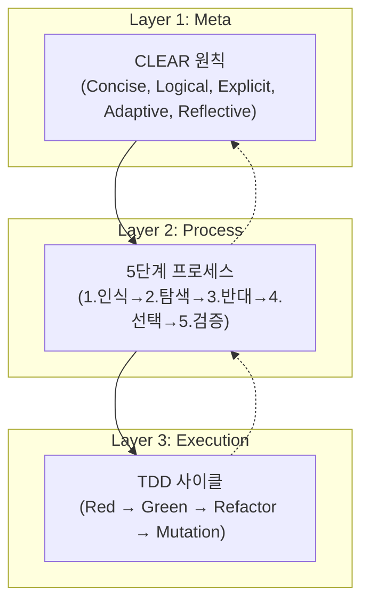

# 201_CJ_AI_개발방법론_종합분석_리포트 (Roblox 전환용)

> **원문 위치**: `/7001_Dev Methodology/200_CJ_AI_Dev Methodology`
> **실전 적용**: `/2000_Web/100_Web_Fly_paper_plane`
> **작성일**: 2026-01-25
> **목적**: 웹 기반 방법론을 분석하여 로블록스 개발에 최적화된 방법론으로 전환

---

## 1. 원문 방법론 구조 분석

### 1.1 방법론 진화 (Version History)
| 버전 | 주요 변화 | 핵심 키워드 |
|:---:|:---|:---|
| **v1.1** | 3-Layer (Meta, Process, Execution) 기초 확립 | CLEAR 원칙, 5단계 프로세스 |
| **v1.2** | 4-Layer 제품 분해 (Product→Block→Feature→Task), 적응성 추가 | 프랙탈 TDD, Miller's Law |
| **v1.3** | Integration TDD + DoD 체계화 + Launch Roadmap | 피라미드 검증 |
| **v2.0** | 검증 프로세스 강화 (핵심 파일 읽기 + 실행 테스트 필수화) | Verification-Centric |
| **v2.1** | Agent-Driven Automation + Zero-Friction Full Mode | AI 주도 완전 자동화 |

### 1.2 3-Layer 수직 구조 (How to Think & Execute)


### 1.3 4-Layer 수평 구조 (What to Decompose)
```
Product (제품) → E2E Test
  └── Block (블럭, 3-5개) → Module Test
        └── Feature (중단위, 3-5개) → Integration Test
              └── Task (작은단위, 5개 고정) → Unit Test (1-2시간)
```
**핵심**: 모든 계층에서 TDD 사이클을 **프랙탈 패턴**으로 반복 적용.

---

## 2. 실전 적용 사례 분석 (종이비행기 프로젝트)

### 2.1 프로젝트 개요
| 항목 | 내용 |
|:---|:---|
| **프로젝트명** | 종이비행기 날아라 (Fly Paper Plane) |
| **기술 스택** | React, TypeScript, Three.js, Zustand, Vitest, Playwright |
| **구조** | 1 Product = 4 Blocks = 14 Features = 70 Tasks |

### 2.2 실전 Block 구조
| Block | 역할 | Features | 비고 |
|:---|:---|:---:|:---|
| **Block 1**: Flight Control | 비행 입력/시뮬레이션/물리엔진 | 3 | Domain Layer |
| **Block 2**: Game Core | 게임 세션/스코어/타이머 | 3 | Domain Layer |
| **Block 3**: Social | 인증/리더보드/기록관리 | 3 | Domain Layer |
| **Block 4**: UI/UX Integration | 메인메뉴/HUD/결과화면/3D환경/사운드 | 5 | Presentation Layer (추후 추가) |

### 2.3 주요 산출물
- `Product_PRD_종이비행기날아라.md`: 제품 요구사항 (1856줄, E2E Test 계획 포함)
- `Block{1-4}_*.md`: 각 Block별 설계 + Feature + Task 통합 문서
- `LAUNCH_ROADMAP.md`: 배포 계획 및 검증 전략
- `Evaluation_Report.md` / `Improvement_Proposal.md`: 회고 및 개선점

### 2.4 템플릿 활용
- **Product_PRD_템플릿.md**: PRD 작성 가이드 (17,560 bytes)
- **Block_템플릿_통합.md**: Block + Feature + Task를 하나의 문서로 관리 (14,724 bytes)

---

## 3. 웹 vs 로블록스 환경 비교

| 차원 | 웹 (Web) | 로블록스 (Roblox) |
|:---|:---|:---|
| **언어** | TypeScript | Luau |
| **런타임** | Browser (V8/SpiderMonkey) | Roblox Server / Client |
| **테스트 도구** | Jest/Vitest (Unit), Playwright (E2E) | **TestEZ** (Unit), Studio Play Mode (E2E) |
| **변이 테스트** | Stryker | (미지원, 수동 검증) |
| **상태 관리** | Zustand/Redux | Module Scripts + RemoteEvent |
| **3D 렌더링** | Three.js | Roblox Engine (Workspace) |
| **빌드/배포** | Vite → CI/CD → Vercel | **Rojo Sync** → Roblox Cloud |
| **동기화** | Git + npm | **Rojo 7.6.1** + default.project.json |

---

## 4. 로블록스 전환을 위한 핵심 과제

### 4.1 테스트 전략 전환
| 계층 | 웹 (현재) | 로블록스 (제안) |
|:---|:---|:---|
| **Task** | Jest `describe/it` | TestEZ `describe/it` or Luau assertions |
| **Feature** | Vitest Integration | TestEZ Module Test + RemoteEvent Mock |
| **Block** | Module Test | ServerScriptService + ReplicatedStorage 분리 테스트 |
| **Product** | Playwright E2E | Studio Play Mode + Bot Player Automation |

### 4.2 4-Layer 구조 매핑
```
Product PRD → Rojo default.project.json (Tree 구조)
  └── Block → ServerScriptService / ReplicatedStorage 폴더
        └── Feature → Module Script 그룹
              └── Task → 개별 함수/메서드
```

### 4.3 문서 템플릿 전환 필요 사항
- **Product_PRD 템플릿**: E2E 시나리오를 Studio Play Mode 기준으로 변경
- **Block 템플릿**: Luau 코드 예시, Rojo 경로 명시
- **CLEAR 원칙**: Luau 특성에 맞게 체크포인트 조정 (예: `type()` 대신 typeof 패턴)

---

## 5. 종이비행기 프로젝트의 교훈 (Lessons Learned)

### 5.1 성공 요인
1. **4-Layer 분해**: 70개 Task를 체계적으로 관리
2. **Block 추가 유연성**: 개발 중 Block 4 (UI/UX) 추가가 가능했음
3. **문서 우선 개발**: PRD → Block 설계 → Task 구현 순서 준수
4. **Launch Roadmap**: 배포 전 E2E 검증 계획 명확화

### 5.2 개선점
- **Block 4 추가 시점**: 초기 설계에서 Presentation Layer 분리 고려 필요
- **변이 테스트 자동화**: 수동 실행보다 CI 통합 권장
- **회고 문서화**: Evaluation_Report.md로 교훈 기록

---

## 6. 로블록스 방법론 전환 로드맵 (Preview)

### Phase 1: 기반 구축 (202번 문서)
- **202_CJ_AI_개발방법론_Roblox_v1.0**: 로블록스 전용 3-Layer + 4-Layer 정의

### Phase 2: 템플릿 제작 (203-204번 문서)
- **203_Product_PRD_템플릿_Roblox**: Rojo + Studio 기반 E2E 계획
- **204_Block_템플릿_Roblox**: Luau 코드 예시 + TestEZ 패턴

### Phase 3: 실전 적용 (205번 문서)
- **205_실전_적용_가이드_Roblox**: Ansible Jump 001 기반 적용 사례

---

## 7. 결론

CJ AI 개발방법론은 **Zero-Friction AI 주도 개발**을 지향하는 고도화된 프레임워크입니다. 웹 프로젝트(종이비행기)에서 4 Blocks × 70 Tasks 규모로 성공적으로 검증되었습니다.

로블록스 환경으로의 전환은 **도구(TestEZ, Rojo)와 언어(Luau)** 차이를 극복하면 충분히 가능하며, 오히려 Roblox의 **Server/Client 분리 아키텍처**가 Block 설계와 자연스럽게 매핑됩니다.

다음 단계: **202번 문서**에서 로블록스 전용 방법론 v1.0을 정의합니다.

---

**Analyzed by Antigravity System V3.0**
*"From the Methodology Archives to the Metaverse."*
