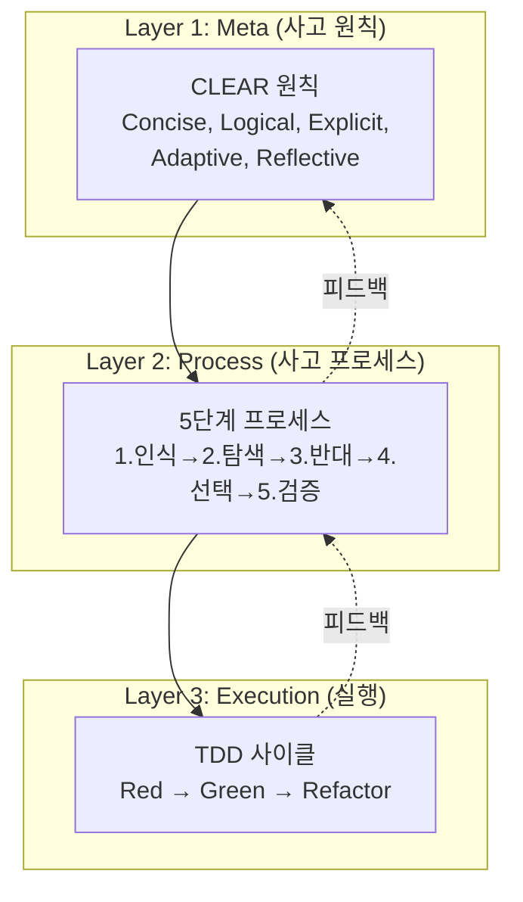

# 202_CJ_AI_개발방법론_Roblox_v1.0

> **기반 문서**: [[../201_Analysis_Report_Web_Methodology|201_웹 방법론 분석 리포트]]
> **버전**: 1.0
> **작성일**: 2026-01-25
> **적용 대상**: 로블록스 게임 개발 (Luau + Rojo)

---

## 🎯 개요

**CJ_AI_개발방법론 Roblox Edition**은 웹 기반 CJ_AI 방법론 v2.1을 로블록스 환경에 최적화한 프레임워크입니다.

> 💡 **핵심 철학**: "Zero-Friction Full Mode"
> 인간은 자연어로 게임 아이디어를 제공하고, AI(Antigravity)가 설계, 문서화, Luau 구현, 검증까지 전담합니다.

---

## 📋 목차

1. [핵심 가치 4가지](#1-핵심-가치-4가지)
2. [3-Layer 수직 구조](#2-3-layer-수직-구조)
3. [4-Layer 수평 구조 (제품 분해)](#3-4-layer-수평-구조-제품-분해)
4. [프랙탈 TDD for Roblox](#4-프랙탈-tdd-for-roblox)
5. [Rojo 워크플로우 통합](#5-rojo-워크플로우-통합)
6. [실무 체크리스트](#6-실무-체크리스트)
7. [템플릿 및 다음 단계](#7-템플릿-및-다음-단계)

---

## 1. 핵심 가치 4가지

### 1.1 🎯 명확성 (Clarity)
- **CLEAR 원칙**으로 Luau 코드 품질 보장
- **5단계 프로세스**로 게임 메카닉 설계 구조화
- **테스트 주도**로 요구사항 코드화

### 1.2 🔄 체계성 (Systematicity)
- **프랙탈 패턴**: Product → Block → Feature → Task 모든 레벨에서 동일 구조
- **Rojo 동기화**: default.project.json 기반 일관된 프로젝트 구조
- **점진적 개선**: 작은 단계로 진행, 매 단계 검증

### 1.3 ✅ 검증성 (Verifiability)
- **Studio Play Mode**: E2E 검증
- **TestEZ**: Unit/Integration 테스트 (Luau)
- **Output 로그**: 런타임 검증

### 1.4 🚀 무마찰 (Zero-Friction)
- **Agent-Driven**: 자연어 지시 → AI 실행
- **Python 자동화**: 대량 오브젝트 생성 스크립트
- **Rojo Serve**: 실시간 동기화

---

## 2. 3-Layer 수직 구조



### Layer 1: CLEAR 원칙 (Roblox 적용)

| 원칙 | 의미 | Roblox 체크 포인트 |
|:---:|:---|:---|
| **C**oncise | 간결성 | 함수당 50줄 이하, ModuleScript 분리 |
| **L**ogical | 논리성 | Server↔Client 명확 분리, 순환 의존 없음 |
| **E**xplicit | 명시성 | 매직 넘버 없음, 모든 Part에 의미있는 Name |
| **A**daptive | 적응성 | 설정값 분리 (Config ModuleScript) |
| **R**eflective | 성찰성 | Output 로그 확인, 디버깅 문서화 |

### Layer 2: 5단계 프로세스

```
1. Clearly Recognize (명확히 인식)
   └─ 게임 메카닉 정의, 타겟 사용자, 제약 조건

2. Explore Diverse Solutions (해법 탐색)
   └─ 3개 이상 구현 방법 비교 (Physics vs Tween, Local vs Remote)

3. Explore Opposites (반대 검토)
   └─ Exploits 리스크, 성능 병목, 네트워크 지연

4. Select Optimal Method (최적 선택)
   └─ 트레이드오프 분석, Server Authority 결정

5. Verify Through Thinking (검증)
   └─ Studio Play Mode 시나리오, Edge Case 시뮬레이션
```

### Layer 3: TDD 사이클 (Roblox)

```
Red (실패 테스트)
 └─ TestEZ describe/it 작성 or print assert
    ↓
Green (최소 구현)
 └─ 테스트 통과하는 최소 Luau 코드
    ↓
Refactor (개선)
 └─ ModuleScript 분리, 중복 제거
    ↓
[Play Mode 검증]
 └─ 실제 게임 환경에서 동작 확인
```

---

## 3. 4-Layer 수평 구조 (제품 분해)

### 계층 구조

```
🎯 Product (제품) ← E2E Test (Studio Play Mode)
  └── 📦 Block (블럭, 3-5개) ← Module Test
        └── ⚙️ Feature (중단위, 3-5개) ← Integration Test
              └── 🔧 Task (작은단위, 5개) ← Unit Test (1-2시간)
```

### Roblox 프로젝트 구조 매핑

```
default.project.json
├── tree
│   ├── ServerScriptService (Block 단위 분리)
│   │   ├── GameEngine (Block 1)
│   │   ├── RaceSystem (Block 2)
│   │   └── DataManager (Block 3)
│   ├── ReplicatedStorage (공유 ModuleScript)
│   │   ├── Shared (Config, Types, Utils)
│   │   └── Packages (외부 라이브러리)
│   ├── StarterPlayerScripts (Client)
│   │   └── ClientModules
│   └── Workspace (3D Objects)
│       ├── Platforms (Block 단위 그룹)
│       └── Environment
```

### 권장 구성

| 단위 | 권장 수량 | 시간 | 테스트 |
|:---|:---:|:---:|:---|
| **Product** | 1 | 2-4주 | E2E (Play Mode 전체 플레이) |
| **Block** | 3-5 | 3-7일 | Module Test (Block 통합) |
| **Feature** | 3-5 /Block | 1-2일 | Integration (Feature 내 Task 조합) |
| **Task** | 5 /Feature | 1-2시간 | Unit (함수/메서드 단위) |

---

## 4. 프랙탈 TDD for Roblox

### 테스트 피라미드 (Bottom-Up 검증)

```
Product E2E ⬆️ (모든 Block 완료 후)
  └─ Studio Play Mode 전체 플레이
     └─ 스타트 → 게임플레이 → 종료 시나리오
  ↑
Block Module Test ⬆️ (Block 완료 후)
  └─ Block 내 모든 Feature 통합 검증
     └─ ServerScriptService/{Block}/ 전체 테스트
  ↑
Feature Integration Test ⬆️ (Feature 완료 후)
  └─ 5개 Task 조합 동작 확인
     └─ ModuleScript 간 호출 흐름
  ↑
Task Unit Test ⬇️ (개발과 동시)
  └─ 개별 함수/메서드 검증
     └─ TestEZ or print assert
```

### TestEZ 예시 (Task 레벨)

```lua
-- ServerScriptService/Tests/GameEngine.spec.lua
return function()
    local GameEngine = require(game.ServerScriptService.GameEngine.GameSession)
    
    describe("GameSession", function()
        it("should start a new session", function()
            local session = GameEngine.new()
            expect(session).to.be.ok()
            expect(session:isRunning()).to.equal(false)
        end)
        
        it("should track elapsed time", function()
            local session = GameEngine.new()
            session:start()
            task.wait(0.1)
            expect(session:getElapsedTime()).to.be.near(0.1, 0.05)
        end)
    end)
end
```

### 간이 검증 (TestEZ 미사용 시)

```lua
-- 개발 중 빠른 검증
local function testGameSession()
    local session = GameSession.new()
    assert(session ~= nil, "Session should exist")
    session:start()
    task.wait(0.1)
    assert(session:isRunning() == true, "Session should be running")
    print("[TEST PASS] GameSession basic test")
end

testGameSession()
```

---

## 5. Rojo 워크플로우 통합

### 프로젝트 시작

```bash
# 1. Rojo 프로젝트 초기화
rojo init my-game

# 2. default.project.json 구조화 (4-Layer 반영)
# 3. Rojo serve 시작
./rojo serve

# 4. Studio에서 Connect
```

### default.project.json 예시

```json
{
  "name": "My Roblox Game",
  "tree": {
    "$className": "DataModel",
    "ServerScriptService": {
      "$className": "ServerScriptService",
      "Block1_GameCore": { "$path": "src/server/GameCore" },
      "Block2_RaceSystem": { "$path": "src/server/RaceSystem" },
      "Tests": { "$path": "src/server/Tests" }
    },
    "ReplicatedStorage": {
      "$className": "ReplicatedStorage",
      "Shared": { "$path": "src/shared" }
    },
    "StarterPlayer": {
      "$className": "StarterPlayer",
      "StarterPlayerScripts": {
        "$className": "StarterPlayerScripts",
        "ClientModules": { "$path": "src/client" }
      }
    }
  }
}
```

### 일일 워크플로우

```
1. git pull (팀 작업 시)
2. ./rojo serve
3. Studio Connect
4. Task 구현 (Red → Green → Refactor)
5. Play Mode 검증
6. git commit (Task 단위)
7. Feature 완료 시 Integration Test
```

---

## 6. 실무 체크리스트

### CLEAR 원칙 (Roblox)

- [ ] **Concise**: 함수 50줄 이하, 파일 200줄 이하
- [ ] **Logical**: Server/Client 분리, 단방향 의존
- [ ] **Explicit**: 모든 Part/Script Name 의미 명확
- [ ] **Adaptive**: Config 분리, 하드코딩 없음
- [ ] **Reflective**: Output 로그 확인, 문서화

### Task 완료 기준 (DoD)

- [ ] 기능 구현 완료
- [ ] Unit Test 통과 (TestEZ or assert)
- [ ] Play Mode 동작 확인
- [ ] Output 에러 없음
- [ ] 코드 리뷰 (AI 또는 팀)

### Feature 완료 기준

- [ ] 5개 Task 모두 완료
- [ ] Integration Test 통과
- [ ] 문서 업데이트 (Block_*.md)

### Block 완료 기준

- [ ] 모든 Feature 완료
- [ ] Module Test 통과
- [ ] Block 간 연동 확인

### Product 완료 기준

- [ ] 모든 Block 완료
- [ ] E2E Test (전체 플레이) 통과
- [ ] Publish to Roblox 성공
- [ ] Launch Roadmap 문서 완료

---

## 7. 템플릿 및 다음 단계

### 후속 문서 (예정)

| 번호 | 문서명 | 내용 |
|:---:|:---|:---|
| 203 | Product_PRD_템플릿_Roblox | 제품 요구사항 템플릿 (E2E 계획 포함) |
| 204 | Block_템플릿_Roblox | Block + Feature + Task 통합 템플릿 |
| 205 | 실전_적용_가이드 | Ansible Jump 001 기반 적용 사례 |

### 빠른 시작

```
1. PRD 작성 (203 템플릿 사용)
2. Block 분해 (3-5개)
3. Feature 분해 (각 Block당 3-5개)
4. Task 분해 (각 Feature당 5개)
5. Task 단위 TDD 구현
6. 상향식 검증 (Task → Feature → Block → Product)
7. Publish & Launch
```

---

## 📚 참고 문서

- [[../201_Analysis_Report_Web_Methodology|201_웹 방법론 분석 리포트]]
- [[../../100_Ansible Logic Jump/doc/119_Debugging_Log_And_Lessons_Learned|119_디버깅 로그 및 교훈]]
- [Rojo Documentation](https://rojo.space/docs)
- [TestEZ](https://github.com/Roblox/testez)

---

**Created by Antigravity System V3.0**
*"Adapting the Methodology for the Metaverse."*
