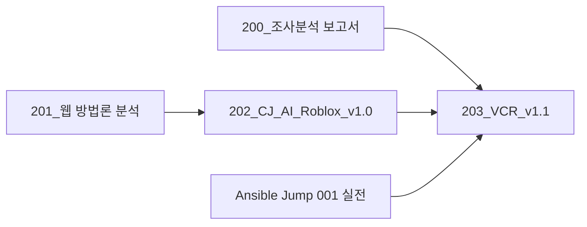
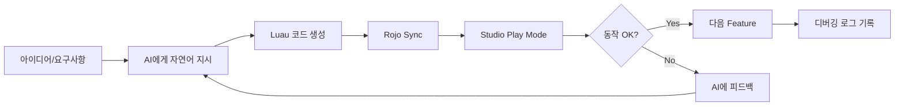

# 203_VCR_개발방법론_v1.1 (Vibe Coding Roblox)

> **버전**: 1.1
> **기반 문서**: [[./202_CJ_AI_개발방법론_Roblox_v1.0|202_CJ_AI_개발방법론_Roblox_v1.0]]
> **적용 리서치**: [[./200_Roblox_개발방법론_조사분석_보고서|200_조사분석 보고서]]
> **작성일**: 2026-01-25
> **변경 사항**: 해외 Best Practices + Vibe Coding 연구 + Ansible Jump 001 실전 경험 통합

---

## 📋 문서 계보 (Document Lineage)



| 문서 | 역할 |
|:---|:---|
| **201** | 웹 기반 CJ_AI 방법론 분석 |
| **202** | 로블록스 초기 적응 (v1.0) |
| **200** | 해외 사례 + Vibe Coding + 학술 연구 조사 |
| **203 (본 문서)** | 202 + 200 통합 → VCR v1.1 |

---

## 🎯 개요

**VCR (Vibe Coding Roblox) 방법론**은 AI 보조 개발(Vibe Coding)을 핵심으로 하는 로블록스 게임 개발 프레임워크입니다.

> 💡 **핵심 철학**: "자연어로 아이디어를 전달하고, AI가 코드를 생성하며, 인간은 결과를 검증한다."
> — Andrej Karpathy (2025)

### v1.1 주요 변경사항 (vs 202 v1.0)

| 변경 영역 | v1.0 (202) | v1.1 (203) |
|:---|:---|:---|
| **개발 모델** | TDD 중심 | **Vibe Coding 중심** (결과 검증 우선) |
| **테스트** | TestEZ 필수 | TestEZ 선택 + **Play Mode 필수** |
| **문서화** | CLEAR 체크리스트 | **디버깅 로그 + 교훈 기록** 강조 |
| **자동화** | 수동 작업 | **Python 스크립트 자동화** 권장 |
| **프레임워크** | Knit 언급 | **ModuleScript + DI 패턴** 권장 |

---

## 📋 목차

1. [5-Layer VCR 구조](#1-5-layer-vcr-구조)
2. [CLEAR 원칙 (Roblox 적용)](#2-clear-원칙-roblox-적용)
3. [4-Layer 제품 분해](#3-4-layer-제품-분해)
4. [Vibe Coding 워크플로우](#4-vibe-coding-워크플로우)
5. [테스트 및 검증](#5-테스트-및-검증)
6. [도구 스택](#6-도구-스택)
7. [실전 체크리스트](#7-실전-체크리스트)
8. [실전 사례: Ansible Jump 001](#8-실전-사례-ansible-jump-001)

---

## 1. 5-Layer VCR 구조

```
┌─────────────────────────────────────────────────────────┐
│  Layer 1: IDEA (아이디어)                               │
│    └─ 게임 컨셉을 자연어로 설명                         │
│       "25개 발판의 극한 점프맵을 만들어줘"              │
├─────────────────────────────────────────────────────────┤
│  Layer 2: AI GENERATION (AI 생성)                       │
│    └─ Claude/Antigravity가 Luau 코드 + 구조 생성        │
│       → ModuleScript, ServerScript, 자동화 스크립트     │
├─────────────────────────────────────────────────────────┤
│  Layer 3: SYNC (동기화)                                 │
│    └─ Rojo Serve → Studio Connect                       │
│       → 파일시스템 ↔ Studio 실시간 반영                 │
├─────────────────────────────────────────────────────────┤
│  Layer 4: VERIFY (검증)                                 │
│    └─ Studio Play Mode에서 동작 확인                    │
│       → Output 로그 확인, 게임플레이 테스트             │
├─────────────────────────────────────────────────────────┤
│  Layer 5: ITERATE & DOCUMENT (반복 및 문서화)           │
│    └─ 피드백 → AI 수정 요청 → 재테스트                  │
│       → 디버깅 로그 기록, 교훈 문서화                   │
└─────────────────────────────────────────────────────────┘
```

---

## 2. CLEAR 원칙 (Roblox 적용)

> **출처**: CJ_AI 개발방법론 v2.1, 200번 조사 결과 반영

| 원칙 | 의미 | Roblox 체크 포인트 |
|:---:|:---|:---|
| **C**oncise | 간결성 | 함수 50줄 이하, ModuleScript 분리, Guard Clauses 사용 |
| **L**ogical | 논리성 | Server/Client 명확 분리, 단방향 의존, Game:GetService() 사용 |
| **E**xplicit | 명시성 | 모든 Part에 의미있는 Name, 매직 넘버 없음 |
| **A**daptive | 적응성 | Config ModuleScript 분리, 하드코딩 지양 |
| **R**eflective | 성찰성 | Output 로그 확인, 디버깅 문서화, 교훈 기록 |

### 코딩 스타일 가이드 (해외 표준)

```lua
-- ✅ 권장
local Players = game:GetService("Players")
local CONFIG = require(script.Parent.Config)

local function onPlayerAdded(player: Player)
    if not player then return end  -- Guard Clause
    -- 로직
end

Players.PlayerAdded:Connect(onPlayerAdded)
```

```lua
-- ❌ 지양
game.Players.PlayerAdded:connect(function(player)
    if player then
        -- 중첩 로직
    end
end)
```

---

## 3. 4-Layer 제품 분해

### 계층 구조

```
🎯 Product (제품) ← E2E: Studio Play Mode 전체 플레이
  └── 📦 Block (블럭, 3-5개) ← Integration: Block 기능 통합 테스트
        └── ⚙️ Feature (중단위, 3-5개) ← Module: Feature 동작 확인
              └── 🔧 Task (작은단위, 5개) ← Unit: 개별 함수/스크립트
```

### Rojo 프로젝트 구조 매핑

```
default.project.json
├── ServerScriptService
│   ├── Block1_GameCore/     # 도메인 로직
│   ├── Block2_RaceSystem/   # 게임 메카닉
│   └── Block3_Data/         # 데이터 관리
├── ReplicatedStorage
│   └── Shared/              # 공유 모듈 (Config, Types, Utils)
├── StarterPlayerScripts
│   └── Client/              # 클라이언트 로직
└── Workspace
    └── GameObjects/         # 3D 오브젝트
```

### 권장 분해 규모

| 프로젝트 규모 | Block | Feature | Task | 예상 시간 |
|:---|:---:|:---:|:---:|:---:|
| **소형** (점프맵) | 2-3 | 6-9 | 30-45 | 1-2일 |
| **중형** (시뮬레이터) | 3-4 | 9-12 | 45-60 | 1-2주 |
| **대형** (MMO) | 5+ | 15+ | 75+ | 1개월+ |

---

## 4. Vibe Coding 워크플로우

### 일일 개발 사이클



### 단계별 상세

#### Layer 1: IDEA
```markdown
## Feature 요청 예시
"25개 발판이 있는 극한 점프맵을 만들어줘.
- 발판 높이: 10~20m
- 떨어지면 즉사 후 리스폰
- 타이머 표시 (0.01초 단위)"
```

#### Layer 2: AI GENERATION
- Claude/Antigravity가 코드 생성
- Python 스크립트로 대량 오브젝트 자동 생성
- ModuleScript 구조화

#### Layer 3: SYNC
```bash
# Rojo 서버 시작
./rojo serve

# Studio에서 Connect
# Plugins → Rojo → Connect
```

#### Layer 4: VERIFY
- **Play Mode 테스트**: F5 또는 Play 버튼
- **Output 로그 확인**: 에러 메시지 체크
- **게임플레이 검증**: 실제 플레이어 관점에서 테스트

#### Layer 5: ITERATE & DOCUMENT
```markdown
## 디버깅 로그 예시
### Issue #1: 발판 감지 안됨
- **증상**: Touched 이벤트 미발생
- **원인**: CanCollide = false
- **해결**: CanCollide = true로 변경
- **교훈**: 센서와 물리 발판 구분 필요
```

---

## 5. 테스트 및 검증

### 테스트 피라미드 (VCR 버전)

```
          ┌──────────────┐
          │ E2E (선택)   │ ← Studio Play Mode 전체 플레이
          │ TestEZ E2E   │
          └──────┬───────┘
                 │
        ┌────────┴────────┐
        │ Integration     │ ← Feature 동작 검증
        │ Play Mode Test  │   (2-3개 Task 조합)
        └────────┬────────┘
                 │
    ┌────────────┴────────────┐
    │ Unit                    │ ← 개별 함수/모듈
    │ Print Assert / TestEZ   │
    └─────────────────────────┘
```

### 권장 테스트 방식

| 레벨 | 방법 | 도구 |
|:---|:---|:---|
| **Task (Unit)** | Print Assert 또는 TestEZ | Output 로그 |
| **Feature (Integration)** | Play Mode 수동 테스트 | Studio |
| **Block (Module)** | 블럭 전체 동작 확인 | Play Mode |
| **Product (E2E)** | 전체 게임플레이 | Play Mode |

### 간이 테스트 패턴

```lua
-- Print Assert 패턴 (TestEZ 없이)
local function testGameSession()
    local session = require(script.Parent.GameSession)
    
    -- Test 1: 세션 생성
    local s = session.new()
    assert(s ~= nil, "[FAIL] Session should exist")
    print("[PASS] Session created")
    
    -- Test 2: 세션 시작
    s:start()
    assert(s:isRunning() == true, "[FAIL] Session should be running")
    print("[PASS] Session started")
    
    print("[TEST COMPLETE] GameSession: All tests passed")
end

testGameSession()
```

---

## 6. 도구 스택

### 필수 도구

| 도구 | 역할 | 설치 |
|:---|:---|:---|
| **Roblox Studio** | 게임 개발 환경 | 공식 다운로드 |
| **Rojo 7.6+** | Studio ↔ 파일시스템 동기화 | `cargo install rojo` |
| **VSCode** | 외부 코드 편집기 | 공식 다운로드 |
| **Git** | 버전 관리 | `brew install git` |

### AI 도구

| 도구 | 역할 |
|:---|:---|
| **Claude (Opus/Sonnet)** | 코드 생성, 디버깅, 문서화 |
| **Antigravity** | 통합 AI 에이전트 |
| **Roblox MCP** | Studio ↔ AI 직접 연동 |

### 품질 도구 (권장)

| 도구 | 역할 | 설치 |
|:---|:---|:---|
| **Selene** | 정적 분석 (Linter) | `cargo install selene` |
| **StyLua** | 코드 포매터 | `cargo install stylua` |
| **Roblox LSP** | 자동완성/타입체크 | VSCode Extension |

### 자동화 도구

| 도구 | 역할 |
|:---|:---|
| **Python 3** | 대량 오브젝트 생성 스크립트 |
| **Foreman** | 도구 체인 관리 |

---

## 7. 실전 체크리스트

### Task 완료 기준 (DoD)

- [ ] 기능 구현 완료
- [ ] Play Mode에서 동작 확인
- [ ] Output 에러 없음
- [ ] (선택) Print Assert 통과

### Feature 완료 기준

- [ ] 모든 Task 완료
- [ ] Play Mode에서 Feature 전체 동작 확인
- [ ] 디버깅 로그 업데이트

### Block 완료 기준

- [ ] 모든 Feature 완료
- [ ] Block 간 연동 확인
- [ ] 문서 업데이트

### Product 완료 기준

- [ ] 모든 Block 완료
- [ ] E2E 전체 플레이 테스트
- [ ] Roblox에 Publish 성공
- [ ] 런칭 문서 작성

### 디버깅 로그 템플릿

```markdown
## Issue #N: [증상 요약]
- **발생 시점**: [언제]
- **증상**: [무엇이 잘못됨]
- **원인**: [왜 발생했는지]
- **해결**: [어떻게 고쳤는지]
- **교훈**: [다음에 기억할 점]
```

---

## 8. 실전 사례: Ansible Jump 001

### 프로젝트 요약

| 항목 | 내용 |
|:---|:---|
| **게임명** | Ansible Jump 001 |
| **장르** | 극한 고공 점프맵 |
| **개발 시간** | 4.5시간 |
| **방법론** | VCR (Vibe Coding Roblox) |
| **결과** | 런칭 성공 (2026-01-25) |

### 적용된 VCR 요소

| Layer | 적용 내용 |
|:---|:---|
| **IDEA** | "25개 발판, 극한 점프, 타이머" 자연어 요청 |
| **AI GENERATION** | Luau 스크립트 + Python 발판 생성 자동화 |
| **SYNC** | Rojo Serve 실시간 동기화 |
| **VERIFY** | Play Mode 즉시 테스트 |
| **ITERATE** | 119_Debugging_Log 기록 |

### 핵심 교훈

1. **Rojo 대량 변경 시 재시작**
2. **BrickColor → Color3 RGB 사용**
3. **센서 vs 물리 발판 구분**
4. **서버+클라이언트 양쪽 이벤트 처리**

---

## 📚 참고 문서

- [[./200_Roblox_개발방법론_조사분석_보고서|200_조사분석 보고서]]
- [[./202_CJ_AI_개발방법론_Roblox_v1.0|202_CJ_AI_Roblox_v1.0]]
- [[../201_Analysis_Report_Web_Methodology|201_웹 방법론 분석]]
- [[../../100_Ansible Logic Jump/doc/119_Debugging_Log_And_Lessons_Learned|119_Debugging Log]]

---

**VCR Methodology v1.1**
**Created by Antigravity System V3.0**
*"Vibe First, Verify Fast, Document Always."*
