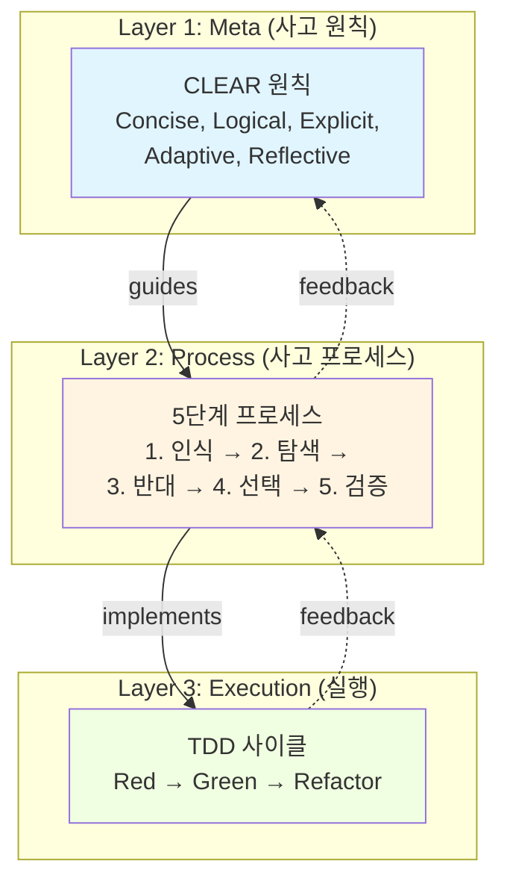
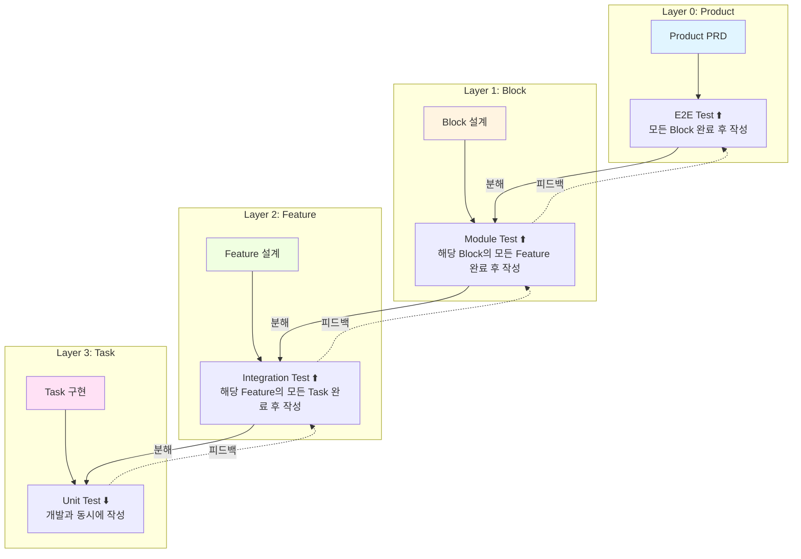
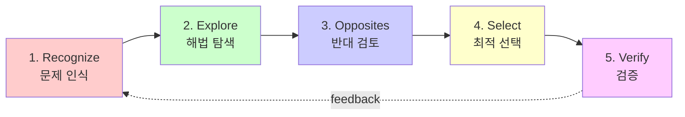
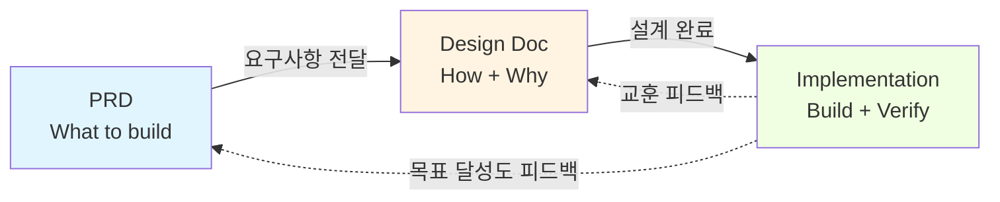

## 관련 문서

**방법론 문서:**
- [[../8000_ai_tdd_research|AI+TDD 연구 메인 인덱스]]
- [[./CJ_AI_개발방법론_요약본|CJ_AI_개발방법론 요약본]] ⚡ - 빠른 참조 가이드 (20분)
- [[./계층적_TDD_가이드|계층적 TDD 가이드]] - 프랙탈 TDD 패턴 심층 가이드

**템플릿 (4-Layer):**
- [[./templates/Product_PRD_템플릿|Product PRD 템플릿]] - 제품 레벨 (E2E Test)
- [[./templates/Block_템플릿_통합|Block 템플릿 (통합)]] - Block + Feature + Task 통합 (실무용) ⭐

**연구 분석:**
- [[../06_분석결과/AI_TDD_종합_요약_보고서|AI+TDD 종합 요약 보고서]]
- [[../06_분석결과/AI_TDD_다차원_분석_보고서|AI+TDD 다차원 분석 보고서]]

---

# CJ_AI_개발방법론 (완전판)

> 📚 **완전판 가이드** (60분 독서, 템플릿 + 실전 예시 포함)
>
> 빠른 참조가 필요하면 [[./CJ_AI_개발방법론_요약본|요약본 (20분)]]을 먼저 읽어보세요.

**버전:** 2.1
**작성일:** 2025-11-07
**최종 업데이트:** 2025-11-19 (Agent-Driven Automation & Zero-Friction 도입)
**작성자:** CJ (Claude Code Agent 체인 활용)

---

## 📋 목차

1. [개요](#개요)
2. [핵심 가치 3가지](#핵심-가치-3가지)
3. [3-Layer 구조](#3-layer-구조)
4. [계층적 구조 (4-Layer 제품 분해)](#계층적-구조-4-layer-제품-분해) ⭐ **NEW**
5. [실무 적용 가이드](#실무-적용-가이드)
6. [핵심 체크리스트](#핵심-체크리스트)
7. [프롬프트 템플릿](#프롬프트-템플릿)
8. [문서 템플릿](#문서-템플릿) ⭐
9. [실전 예시](#실전-예시) ⭐
10. [FAQ](#faq)
11. [다음 단계](#다음-단계)

---

## 개요

**CJ_AI_개발방법론**은 AI(Claude Code) 시대에 맞춘 **사고방식 + 실행방법 + 검증 프로세스**를 통합한 소프트웨어 개발 프레임워크입니다.

> 💡 **v2.1 핵심 철학**: "Zero-Friction Full Mode"
> 인간은 자연어로 지시하고, AI가 모든 규율(문서화, TDD, 구조 관리)을 전담합니다. 타협(Lite 모드)은 없습니다. AI가 복잡성을 흡수하여 마찰을 0으로 만듭니다.

### 무엇이 다른가?

기존 방법론은 "어떻게 코드를 작성할 것인가"에 초점을 맞췄다면, CJ_AI 방법론은:
- **사고 방식** (CLEAR 원칙 + 5단계 프로세스)
- **실행 방법** (TDD 사이클)
- **AI 활용** (Code-Aware Prompting)
- **적응성** (프로젝트 특성에 따라 구조 조정) - v1.2
- **통합 전략** (Integration TDD + DoD 체계화 + Launch Roadmap) - v1.3
- **검증 프로세스** (핵심 파일 읽기 + 실행 테스트 필수화) - v2.0
- **자동화 전략** (Agent-Driven Tools + Zero-Friction) ⭐ v2.1 추가

이 일곱 가지를 **계층적으로 통합**합니다.

### 누구를 위한 것인가?

- AI(Claude Code, Cursor 등)를 활용하는 개발자
- 체계적인 사고 프로세스가 필요한 팀
- 코드 품질을 높이고 싶은 모든 개발자

---

## 핵심 가치 3가지

### 1. 🎯 명확성 (Clarity)
**모든 의도를 명시적으로 표현**

- CLEAR 원칙으로 품질 보장
- 5단계로 사고 과정 구조화
- TDD로 요구사항 코드화

### 2. 🔄 체계성 (Systematicity)
**반복 가능한 프로세스**

- 프랙탈 패턴: 모든 레벨에서 동일한 구조
- 이중 피드백 루프: 전술적 + 전략적
- 점진적 개선: 작은 단계로 진행

### 3. ✅ 검증성 (Verifiability)
**모든 결과는 검증 가능**

- TDD: 테스트로 동작 검증
- 변이 테스트: 테스트 품질 검증
- CLEAR: 코드 품질 검증

### 4. 🚀 무마찰 (Zero-Friction) ⭐ v2.1
**AI 주도 완전 자동화**

- **Agent-Driven**: 사용자는 자연어 지시, AI는 도구 실행
- **No Compromise**: Lite 모드 없음, AI가 Full Track 수행
- **Context-Aware**: 템플릿 내 AI Context로 즉시 맥락 파악

---

## 3-Layer 구조



### Layer 1: CLEAR 원칙 (Meta)

모든 산출물이 만족해야 할 **불변 품질 속성**:

| 원칙 | 의미 | 체크 포인트 |
|------|------|------------|
| **C**oncise | 간결성 | 복잡도 < 10, 중복 코드 없음 |
| **L**ogical | 논리성 | 명확한 인과관계, 순환 의존 없음 |
| **E**xplicit | 명시성 | 매직 넘버 없음, 의도 명확 |
| **A**daptive | 적응성 | 변경 영향 < 20%, 확장 용이 |
| **R**eflective | 성찰성 | 피드백 루프 존재, 지속 개선 |

### Layer 2: 5단계 프로세스 (Process)

**문제 → 솔루션** 변환 알고리즘:

```
1. Clearly Recognize (명확히 인식하고 고려)
   └─ 문제 정의, 맥락 분석, 제약 조건 파악

2. Explore Diverse Solutions (다양한 해법 탐색)
   └─ 3개 이상 솔루션 후보 도출

3. Explore Opposites (반대를 긍정요소로)
   └─ 리스크 분석, 제약을 기회로 전환

4. Select Optimal Method (최적 방법 선택)
   └─ 종합 판단, 트레이드오프 분석

5. Verify Through Thinking (사고과정으로 검증)
   └─ 논리적 타당성, 예상 결과 시뮬레이션
```

### Layer 3: TDD 사이클 (Execution)

**코드 품질 보장 메커니즘**:

```
Red (실패 테스트)
 └─ 요구사항을 테스트로 명시 (CLEAR.Explicit)
    ↓
Green (최소 구현)
 └─ 테스트 통과하는 최소 코드 (CLEAR.Concise)
    ↓
Refactor (개선)
 └─ 중복 제거, 구조 개선 (CLEAR.Logical + Adaptive)
    ↓
[변이 테스트]
 └─ 테스트 품질 검증 (80%+ 목표)
```

---

## 계층적 구조 (4-Layer 제품 분해)

### 두 가지 차원의 구조

**CJ_AI_개발방법론**은 두 가지 독립적이면서도 상호보완적인 구조를 가집니다:

| 차원 | 구조 | 의미 | 적용 범위 |
|------|------|------|----------|
| **수직적** | 3-Layer<br/>(Meta → Process → Execution) | 방법론의 철학적 계층<br/>어떻게 생각하고 실행하는가 | 모든 작업에 적용 |
| **수평적** | 4-Layer<br/>(Product → Block → Feature → Task) | 제품 분해의 실무 계층<br/>무엇을 어떻게 나누는가 | 제품/프로젝트 구조 |

> 💡 **핵심 아이디어**: 4-Layer의 **모든 계층**에서 3-Layer (CLEAR + 5단계 + TDD)를 **반복 적용**합니다.
> 이것이 바로 **프랙탈 패턴**입니다.

---

### 4-Layer 계층 구조

```
🎯 Layer 0: Product (제품)
   └─ N Blocks (프로젝트 특성에 따라 결정)
       │
       ├─ 📦 Layer 1: Block (블럭)
       │   └─ M Features (3~5개 권장)
       │       │
       │       ├─ ⚙️ Layer 2: Feature (중단위)
       │       │   └─ 5 Tasks
       │       │       │
       │       │       ├─ 🔧 Layer 3: Task (작은단위)
       │       │       │   └─ 1-2 hours work
       │       │       │
       │       │       ├─ 🔧 Task 2
       │       │       ├─ 🔧 Task 3
       │       │       ├─ 🔧 Task 4
       │       │       └─ 🔧 Task 5
       │       │
       │       ├─ ⚙️ Feature 2 (5 Tasks)
       │       └─ ⚙️ Feature M (5 Tasks)
       │
       ├─ 📦 Block 2 (M Features, M×5 Tasks)
       └─ 📦 Block N (M Features, M×5 Tasks)

총 구성: 1 제품 = N 블럭 = N×M 중단위 = N×M×5 작은단위
```

**권장 구성 (v1.2 - Adaptive)** ⭐:
- 1개 제품 = **N개 블럭** (3-5개 권장, 프로젝트 특성에 따라 유연하게 조정)
- 1개 블럭 = **M개 중단위(Feature)** (3-5개 권장, Miller's Law: 7±2)
- 1개 중단위 = **5개 작은단위(Task)** (고정, Miller's Law: 7±2)
- 1개 작은단위 = **1-2시간 작업** (고정, 인지 부하 관리)

**실제 사례 (7100_Fly_paper_plane):**
- 초기 계획: 1 Product = 3 Blocks = 9 Features = 45 Tasks
- 확장 후: 1 Product = 4 Blocks = 14 Features = 70 Tasks
  - Block 1-3: 도메인 로직 (비행, 게임, 소셜)
  - Block 4: UI/UX 통합 (Clean Architecture Presentation Layer)

> 💡 **v1.2 핵심 변화**: "3 Blocks"는 가이드라인이며 고정 규칙이 아닙니다.
> 프로젝트 특성, 아키텍처 요구사항에 따라 Block 수를 유연하게 조정하세요.

---

### 프랙탈 TDD: 모든 레벨에서 동일한 패턴

**핵심 원리**: 각 계층마다 TDD 사이클을 독립적으로 적용하되, 테스트 유형과 스코프만 달라집니다.

**작업 흐름: 피라미드 (아래→위)** ⭐

> **실제 개발 방향**: Task 개발(⬇️) → Feature TDD(⬆️) → Block TDD(⬆️) → Product E2E TDD(⬆️) → **Integration TDD(⬆️)** ⭐ v1.3

```
Product Integration TDD ⬆️ (v1.3 신규!) - E2E Test를 Red로 활용
  ↑
Product E2E Test ⬆️ (모든 Block 완료 후 작성)
  ↑
Block Module Test ⬆️ (해당 Block의 모든 Feature 완료 후 작성)
  ↑
Feature Integration Test ⬆️ (해당 Feature의 모든 Task 완료 후 작성)
  ↑
Task Unit Test ⬇️ (개발과 동시에 작성: Red-Green-Refactor-Mutation)
```

**핵심:**
- **Task**: 개발하면서 Unit Test 작성 (⬇️ 하향)
- **Feature Integration TDD**: 해당 Feature의 Task 5개 완료 후 작성 (⬆️ 상향) - Task 개발 중 작성 ❌
- **Block Module TDD**: 해당 Block의 모든 Feature 완료 후 작성 (⬆️ 상향) - Feature 개발 중 작성 ❌
- **Product E2E TDD**: 모든 Block 완료 후 작성 (⬆️ 상향) - Block 개발 중 작성 ❌
- **Product Integration TDD** (v1.3 신규!): Block 개발 완료 후, App.tsx 통합 (E2E Test를 Red로 활용) ⭐



---

### 각 계층별 상세

#### Layer 0: Product (제품)

**역할**: 전체 제품의 비즈니스 목표와 사용자 가치 정의

**문서**: [[./templates/Product_PRD_템플릿|Product PRD 템플릿]]

**TDD 방식**: **E2E (End-to-End) Test**
```typescript
// 제품 레벨: 전체 사용자 워크플로우 검증
describe('Product: 할일 관리 앱', () => {
  it('사용자가 할일을 추가하고 완료하고 삭제할 수 있다', async () => {
    // Given: 사용자가 앱을 연다
    await page.goto('/');

    // When: Block 1 (입력) → Block 2 (관리) → Block 3 (표시) 실행
    await page.fill('[data-testid="todo-input"]', '새 할일');
    await page.click('[data-testid="add-button"]');
    await page.click('[data-testid="todo-1-checkbox"]');
    await page.click('[data-testid="todo-1-delete"]');

    // Then: 최종 비즈니스 가치 달성
    expect(await page.textContent('[data-testid="todo-list"]')).toBe('');
  });
});
```

**구성**: 3개 블럭으로 분해
**일정**: 보통 2-4주
**측정**: Success Metrics (사용자 만족도, 성능 목표 등)

---

#### Layer 1: Block (블럭)

**역할**: 비즈니스 영향을 만드는 독립적인 기능 묶음

**문서**: [[./templates/Block_템플릿_통합|Block 템플릿 (통합)]]

**TDD 방식**: **Module Test** (블럭 간 통합 검증)
```typescript
// 블럭 레벨: 3개 Feature의 조합이 비즈니스 임팩트 생성
describe('Block: 할일 입력 관리', () => {
  it('입력 검증 + 저장 + 알림이 통합 동작한다', () => {
    // Given: Block의 3개 Feature 준비
    const block = new TodoInputBlock(
      validationFeature,    // Feature 1: 입력 검증
      storageFeature,       // Feature 2: 저장
      notificationFeature   // Feature 3: 알림
    );

    // When: Block 전체 실행
    const result = block.execute({ text: '새 할일' });

    // Then: 비즈니스 임팩트 검증
    expect(result.businessImpact.saved).toBe(true);
    expect(result.businessImpact.userNotified).toBe(true);
  });
});
```

**구성**: 3개 Feature로 분해
**일정**: 보통 3-7일
**측정**: 비즈니스 임팩트 달성 여부

---

#### Layer 2: Feature (중단위) ⭐ **가장 중요한 레벨**

**역할**: 사용자가 인식하는 하나의 완결된 기능

**문서**: [[./templates/Block_템플릿_통합|Block 템플릿 (통합)]] 내 Feature 섹션

**TDD 방식**: **Integration Test** (5개 Task의 통합 검증)
```typescript
// Feature 레벨: 5개 Task의 조합이 하나의 기능 완성
describe('Feature: 할일 입력 검증', () => {
  it('빈 값 체크 → 길이 체크 → 중복 체크 → 정규화 → 저장 준비', () => {
    // Given: 5개 Task 준비
    const feature = new InputValidationFeature(
      emptyCheckTask,      // Task 1
      lengthCheckTask,     // Task 2
      duplicateCheckTask,  // Task 3
      normalizeTask,       // Task 4
      prepareTask          // Task 5
    );

    // When: Feature 실행
    const result = feature.validate('  새 할일  ');

    // Then: 기능 수용 기준 충족
    expect(result.isValid).toBe(true);
    expect(result.normalized).toBe('새 할일');
  });
});
```

**구성**: 5개 Task로 분해
**일정**: 보통 1-2일
**측정**: 수용 기준(Acceptance Criteria) 달성

---

#### Layer 3: Task (작은단위)

**역할**: 1-2시간 내에 완료 가능한 최소 구현 단위

**문서**: [[./templates/Block_템플릿_통합|Block 템플릿 (통합)]] 내 Task 섹션

**TDD 방식**: **Unit Test** (함수/클래스 단위)
```typescript
// Task 레벨: 하나의 함수/클래스 검증
describe('Task: 빈 값 체크', () => {
  it('빈 문자열이면 false를 반환한다', () => {
    // Given
    const input = '';

    // When
    const result = checkEmpty(input);

    // Then
    expect(result.isValid).toBe(false);
    expect(result.error).toBe('할일을 입력해주세요');
  });

  it('공백만 있어도 false를 반환한다', () => {
    expect(checkEmpty('   ').isValid).toBe(false);
  });

  it('유효한 입력이면 true를 반환한다', () => {
    expect(checkEmpty('새 할일').isValid).toBe(true);
  });
});
```

**구성**: Red → Green → Refactor → Mutation 사이클
**일정**: 1-2시간
**측정**: 변이 점수 > 80%, 커버리지 > 90%

---

### 프랙탈 패턴의 특징

#### 1. **자기 유사성** (Self-Similarity)
모든 레벨에서 동일한 구조 반복:
```
Red (실패) → Green (구현) → Refactor (개선) → Mutation (검증)
```
- Product: E2E 실패 → Block 구현 → 통합 개선 → 품질 검증
- Block: Module 실패 → Feature 구현 → 구조 개선 → 인터페이스 검증
- Feature: Integration 실패 → Task 구현 → 중복 제거 → 통합 검증
- Task: Unit 실패 → 함수 구현 → 리팩토링 → 변이 테스트

#### 2. **재귀적 구성** (Recursive Composition)
하위 레벨의 Green 단계가 상위 레벨의 구성 요소:
```
Task의 Green → Feature의 Component
Feature의 Green → Block의 Component
Block의 Green → Product의 Component
```

#### 3. **양방향 피드백** (Bidirectional Feedback)
```
상향 피드백 (Bottom-up): AI 주도
[AI] Task 구현 중 이슈 발견 → [AI] Feature 설계 수정 → [AI] Block 구조 조정 → [개발자] Product 요구사항 명확화 (피드백)

하향 피드백 (Top-down): 개발자 주도
[개발자] Product 목표 → [AI] Block 범위 → [AI] Feature 우선순위 → [AI] Task 구현 방향
```

---

### 실전 예시: Simple Todo App 분해

#### Product: 할일 관리 앱
```
목표: 개인 사용자가 할일을 관리할 수 있는 웹 앱
Success Metrics:
- 로딩 시간 < 1초
- 응답 시간 < 200ms
- 테스트 커버리지 > 90%

E2E Test: 사용자가 할일 추가 → 완료 체크 → 삭제까지 전체 흐름
```

#### ↓ 분해: 3 Blocks (간단한 앱의 경우)

**Block 1: 할일 입력 관리**
- Feature 1.1: 입력 검증 (5 Tasks)
- Feature 1.2: 저장 처리 (5 Tasks)
- Feature 1.3: 피드백 표시 (5 Tasks)

**Block 2: 할일 상태 관리**
- Feature 2.1: 완료/미완료 토글 (5 Tasks)
- Feature 2.2: 필터링 (5 Tasks)
- Feature 2.3: 정렬 (5 Tasks)

**Block 3: 할일 표시**
- Feature 3.1: 리스트 렌더링 (5 Tasks)
- Feature 3.2: 반응형 UI (5 Tasks)
- Feature 3.3: 애니메이션 (5 Tasks)

> 💡 **참고**: 이것은 간단한 Todo App이므로 3 Blocks로 충분합니다.
> 더 복잡한 앱(예: 7100_Fly_paper_plane)은 4-5개 Block이 필요할 수 있습니다.

#### ↓ Feature 1.1 예시: 입력 검증 (5 Tasks)

**Feature 1.1 Integration Test**:
```typescript
it('빈 값 체크 → 길이 체크 → 중복 체크 → 정규화 → 저장 준비가 통합 동작', () => {
  // 5개 Task의 조합 검증
});
```

- Task 1.1.1: 빈 값 체크 (1시간)
- Task 1.1.2: 길이 체크 (50분)
- Task 1.1.3: 중복 체크 (1.5시간)
- Task 1.1.4: 텍스트 정규화 (45분)
- Task 1.1.5: DTO 변환 (30분)

#### ↓ Task 1.1.1 예시: 빈 값 체크

```typescript
// Unit Test
describe('checkEmpty', () => {
  it('빈 문자열이면 false 반환', () => {
    expect(checkEmpty('').isValid).toBe(false);
  });

  it('공백만 있어도 false 반환', () => {
    expect(checkEmpty('   ').isValid).toBe(false);
  });
});

// Red → Green → Refactor → Mutation
// 변이 점수: 85% ✅
```

---

### 템플릿과 가이드

계층적 구조를 실무에 적용하기 위한 문서:

| 계층 | 템플릿 | 설명 |
|------|--------|------|
| **Product** | [[./templates/Product_PRD_템플릿\|Product PRD]] | 제품 요구사항 정의, E2E 테스트 계획 |
| **Block** | [[./templates/Block_템플릿\|Block 템플릿]] | 블럭 설계, Module 테스트, SOLID 적용 |
| **Feature** | [[./templates/Feature_템플릿\|Feature 템플릿]] | 중단위 기능, Integration 테스트, 일일 진행 |
| **Task** | [[./templates/Task_템플릿\|Task 템플릿]] | 작은단위 구현, Unit 테스트, 변이 테스트 |

**종합 가이드**: [[./계층적_TDD_가이드|계층적 TDD 가이드]]
- 프랙탈 패턴 심층 설명
- 실전 워크플로우 (일일/주간 계획)
- 도구 및 자동화
- FAQ

---

### 왜 4-Layer인가?

#### 인지과학적 근거: Miller's Law
> "인간은 7±2개의 항목을 동시에 처리할 수 있다"

- **3개 블럭**: 한눈에 전체 구조 파악 가능
- **3개 Feature**: 블럭의 책임을 명확히 분리
- **5개 Task**: Feature의 구현을 관리 가능한 단위로 분할
- **1-2시간 Task**: 집중력 유지 가능한 작업 단위

#### 실무적 근거

**문제점 (계층 없이)**:
```
❌ PRD → 바로 구현
   └─ 100개 작업이 한번에 보임
   └─ 어디서부터 시작할지 막막
   └─ 테스트를 어느 레벨에서 작성할지 불명확
```

**해결책 (4-Layer 적용)**:
```
✅ Product (1개) → Block (3개) → Feature (9개) → Task (45개)
   └─ 한번에 3-5개씩만 집중
   └─ 각 레벨마다 명확한 테스트 전략
   └─ 진행 상황 추적 용이
```

#### 업계 표준과의 일치

| 방법론 | 계층 구조 | 비고 |
|--------|----------|------|
| **Agile/Scrum** | Epic → Feature Set → User Story → Task | CJ_AI와 동일한 4-Layer |
| **SAFe** | Solution → Capability → Feature → Story | 대규모 조직용, 원리는 동일 |
| **Shape Up** | Project → Scope → Task | 3-Layer, Feature 레벨 생략 |

> 💡 **CJ_AI의 차별점**: 모든 레벨에서 TDD를 명시적으로 적용하는 **프랙탈 패턴**

---

### 계층 간 이동 패턴

#### 하향식 (Top-Down): 설계 단계 (AI가 담당)

```
[개발자] 아이디어 제공: "할일 관리 앱"
   ↓
[AI] 1. Product 목표 정의 (PRD 작성)
   ↓
[AI] 2. 3개 Block으로 분해 (비즈니스 임팩트 중심)
   ↓
[AI] 3. 각 Block을 3개 Feature로 분해 (기능 중심)
   ↓
[AI] 4. 각 Feature를 5개 Task로 분해 (구현 중심)
   ↓
[개발자] 설계 검토 및 피드백 → [AI] 수정 반복
   ↓
[AI] 5. Task 단위로 구현 시작
```

**핵심:** 개발자는 아이디어만, AI가 모든 분해 및 설계 담당

#### 상향식 (Bottom-Up): 구현 및 검증 단계 (AI가 담당)

```
[AI] 1. Task 구현 (Red-Green-Refactor-Mutation)
   ↓ 5개 Task 완료
[AI] 2. Feature Integration Test 실행
   ↓ 3개 Feature 완료
[AI] 3. Block Module Test 실행
   ↓ 3개 Block 완료
[AI] 4. Product E2E Test 실행
   ↓
[개발자] 결과 확인 (문서로, 코드 안 봄)
```

**핵심:** AI가 구현, 테스트, 검증 모두 담당

#### 순회 패턴 (Iterative) - AI 주도

```
[AI] Block 1, Feature 1 → 5 Tasks 구현 → Integration Test
   ↓
[개발자] Feature 1 결과 확인 (문서로)
   ↓
[AI] Block 1, Feature 2 → 5 Tasks 구현 → Integration Test
   ↓
[개발자] Feature 2 결과 확인
   ↓
[AI] Block 1, Feature 3 → 5 Tasks 구현 → Module Test
   ↓
[개발자] Block 1 완료 확인
   ↓
[AI] Block 2 시작...
```

**핵심:** AI가 주도하고, 개발자는 중간 검증점에서 확인

---

### 핵심 원칙

1. **명시성**: 각 계층의 경계와 책임을 명확히 정의
2. **일관성**: 모든 계층에서 TDD 패턴 반복 적용
3. **검증성**: 각 계층마다 독립적인 테스트 전략
4. **적응성**: 프로젝트 규모에 따라 계층 조정 가능
5. **성찰성**: 하위 계층의 피드백을 상위 계층에 반영

---

## 실무 적용 가이드

### Agent-Driven Workflow (v2.1) ⭐

**"사용자는 자연어로 지시하고, AI가 도구를 실행합니다."**

1. **구조 생성**:
   - User: "사용자 관리 블록 만들어줘"
   - Agent: `scripts/create_block.ts` 실행 → 폴더/파일 구조 자동 생성

2. **문서화**:
   - User: "로그인 기능 구현해줘"
   - Agent: `Feature_템플릿` 읽기 → `AI Context` 파악 → 문서 작성 → 코드 구현

3. **진척도 관리**:
   - User: "현재 상황 어때?"
   - Agent: `scripts/check_status.ts` 실행 → `task.md` 업데이트 후 보고

---

### 프로젝트 시작 시

#### Step 1: CLEAR 원칙 합의 (30분)
```markdown
**팀 미팅**:
- CLEAR 5가지 원칙 소개
- 우리 팀의 품질 기준 정의
- 코드 리뷰 체크리스트 작성
```

#### Step 2: 5단계 템플릿 준비 (15분)
```bash
# 문서 구조 생성
mkdir -p docs/{requirements,design,adr}

# 템플릿 복사
cp 5단계_템플릿.md docs/design/
```

#### Step 3: TDD 환경 설정 (30분)
```bash
# JavaScript/TypeScript
npm install --save-dev jest @types/jest
npm install --save-dev @stryker-mutator/core

# package.json 스크립트 추가
{
  "scripts": {
    "test": "jest --watch",
    "test:coverage": "jest --coverage",
    "test:mutation": "stryker run"
  }
}
```

---

### 일상 개발 워크플로우

#### 아침 (10분)
```bash
# 1. 최신 코드 동기화
git pull

# 2. 테스트 실행 (백그라운드)
npm test &

# 3. 오늘의 작업 계획
# - 5단계 템플릿으로 작업 정의
```

#### 개발 중 (반복)
```
For each 기능:

  1️⃣ 5단계로 설계 (10-30분)
     ├─ Recognize: 무엇을 만들까?
     ├─ Explore: 어떤 방법이 있을까?
     ├─ Opposites: 리스크는?
     ├─ Select: 어떤 방법으로?
     └─ Verify: 타당한가?

  2️⃣ TDD로 구현 (5-10분/사이클)
     ├─ Red: 실패 테스트 작성
     ├─ Green: 최소 구현
     └─ Refactor: 개선

  3️⃣ CLEAR 검증 (자동)
     └─ ESLint, 커버리지 체크
```

#### 저녁 (10분)
```bash
# 1. 변이 테스트 실행
npm run test:mutation

# 2. 오늘의 회고 (Reflective)
# - 무엇을 배웠나?
# - 개선할 점은?
```

---

### 팀 협업

#### 코드 리뷰 체크리스트
```markdown
## CLEAR 검증
- [ ] **Concise**: 복잡도 적절한가? (< 10)
- [ ] **Logical**: 흐름이 명확한가?
- [ ] **Explicit**: 의도가 명확한가?
- [ ] **Adaptive**: 변경이 용이한가?
- [ ] **Reflective**: 테스트가 충분한가? (>90%)

## 5단계 문서
- [ ] 문제 정의 명확
- [ ] 솔루션 비교 존재
- [ ] 선택 근거 명시

## TDD 검증
- [ ] 모든 테스트 통과
- [ ] 변이 점수 > 80%
```

---

## 핵심 체크리스트

### CLEAR 5가지 원칙

#### ✅ Concise (간결성)
```typescript
// ❌ 나쁜 예: 불필요한 복잡도
function process(data: any) {
  if (data.type === 1 || data.type === 2 || data.type === 3) {
    // 복잡한 분기...
  }
}

// ✅ 좋은 예: 간결한 구조
const handlers = {
  [DataType.USER]: handleUser,
  [DataType.PRODUCT]: handleProduct,
  [DataType.ORDER]: handleOrder
};
function process(data: TypedData) {
  return handlers[data.type](data);
}
```

#### ✅ Logical (논리성)
```typescript
// ❌ 나쁜 예: 숨겨진 부작용
function updateUser(user) {
  user.lastUpdated = Date.now(); // 부작용 숨김
  return user;
}

// ✅ 좋은 예: 명확한 인과관계
function updateUser(user) {
  return {
    ...user,
    lastUpdated: Date.now()
  };
}
```

#### ✅ Explicit (명시성)
```typescript
// ❌ 나쁜 예: 매직 넘버
const isValid = value > 42;

// ✅ 좋은 예: 명시적 상수
const THRESHOLD = 42;
const isValid = value > THRESHOLD;
```

#### ✅ Adaptive (적응성)
```typescript
// ❌ 나쁜 예: 경직된 구조
class UserService {
  saveToMySQL(user) { /* ... */ }
}

// ✅ 좋은 예: 확장 가능한 구조
class UserService {
  constructor(private repository: UserRepository) {}
  save(user) {
    return this.repository.save(user);
  }
}
```

#### ✅ Reflective (성찰성)
```typescript
// ❌ 나쁜 예: 피드백 없음
function processData(data) {
  // 처리만 하고 끝
  return result;
}

// ✅ 좋은 예: 피드백 루프
function processData(data) {
  const result = doProcess(data);
  logMetrics(result); // 피드백 수집
  if (result.needsImprovement) {
    improvementSuggestions(result);
  }
  return result;
}
```

---

### 5단계 프로세스



---

### TDD 사이클

**핵심 원칙**: Red → Green → Refactor 순서 엄수

```
Red (실패 테스트)
├─ 요구사항을 테스트 코드로 작성
├─ 테스트 실행 → FAIL 확인
└─ "무엇을" 만들지 명확해짐

Green (최소 구현)
├─ 테스트를 통과하는 최소 코드
├─ 하드코딩도 허용
└─ 테스트 실행 → PASS 확인

Refactor (개선)
├─ 중복 제거
├─ 구조 개선
├─ 테스트 통과 유지
└─ 변이 테스트로 품질 검증
```

---

## 프롬프트 템플릿

### 템플릿 1: Code-Aware Prompting

**사용 시점**: 기존 코드 개선, 리팩토링

```markdown
## Context
[기존 코드 붙여넣기]

## Current Issue
- 복잡도 높음 (Cyclomatic: 15)
- 중복 코드 존재
- 테스트 부족

## Request
위 코드를 CLEAR 원칙에 맞게 리팩토링해주세요.

**CLEAR 원칙 준수**:
- Concise: 복잡도를 10 이하로
- Logical: 명확한 흐름
- Explicit: 의도 명시
- Adaptive: DI 패턴 사용
- Reflective: 테스트 커버리지 90% 이상

**TDD 방식**:
1. 먼저 특성화 테스트 작성 (현재 동작 보존)
2. 점진적 리팩토링
3. 테스트 통과 유지
```

---

### 템플릿 2: 5단계 프로세스

**사용 시점**: 새로운 기능 설계

```markdown
# Feature: [기능명]

## 1. Clearly Recognize (명확히 인식)
**문제**:
-

**맥락**:
-

**제약 조건**:
-

**성공 기준**:
-

---

## 2. Explore Diverse Solutions (해법 탐색)

### 솔루션 A:
- 접근법:
- 장점:
- 단점:
- 복잡도:

### 솔루션 B:
- 접근법:
- 장점:
- 단점:
- 복잡도:

### 솔루션 C:
- 접근법:
- 장점:
- 단점:
- 복잡도:

---

## 3. Explore Opposites (반대 검토)
**리스크**:
-

**제약이 기회가 되는 경우**:
-

---

## 4. Select Optimal Method (최적 선택)
**선택**: [솔루션 X]

**근거**:
-

**트레이드오프**:
- ✅ 장점:
- ⚠️ 단점 (허용 가능):

---

## 5. Verify Through Thinking (검증)
**논리적 타당성**:
-

**예상 결과**:
-

**피드백 포인트**:
-
```

---

### 템플릿 3: TDD Cycle

**사용 시점**: 기능 구현

```markdown
## Feature: [기능명]

### Red (실패 테스트)

```typescript
describe('[기능명]', () => {
  it('should [예상 동작]', () => {
    // Given
    const input = /* 입력 */;

    // When
    const result = functionName(input);

    // Then
    expect(result).toBe(/* 예상 결과 */);
  });
});
```

**실행 결과**: ❌ FAIL (functionName 미구현)

---

### Green (최소 구현)

**요청**: 위 테스트를 통과하는 최소 구현을 작성해주세요.

---

### Refactor (개선)

**개선 포인트**:
- [ ] 중복 코드 제거
- [ ] 명확한 네이밍
- [ ] 의존성 주입
- [ ] CLEAR 원칙 준수

**요청**: 테스트 통과를 유지하면서 위 포인트를 개선해주세요.

---

### Mutation Test

```bash
npm run test:mutation
```

**목표**: Mutation Score > 80%
```

---

## 📄 문서 템플릿

**CJ_AI_개발방법론**을 실제 프로젝트에 적용하기 위한 **4-Layer 계층적 템플릿**을 제공합니다.

### 템플릿 구조 (프랙탈 TDD)

```
templates/
├── Product_PRD_템플릿.md  (Layer 0) - 제품 레벨 + E2E Test
├── Block_템플릿.md        (Layer 1) - 블럭 레벨 + Module Test
├── Feature_템플릿.md      (Layer 2) - 중단위 레벨 + Integration Test ⭐
└── Task_템플릿.md         (Layer 3) - 작은단위 레벨 + Unit Test

### AI Context Block (v2.1) ⭐

모든 템플릿의 최상단에는 **AI가 맥락을 즉시 파악할 수 있는 메타 데이터**가 포함됩니다.

```markdown
<!-- AI_CONTEXT
Project: [프로젝트명]
Level: [Product | Block | Feature | Task]
Current Focus: [현재 작업 내용]
Related Files: [상위 문서 경로]
-->
```

이 블록 덕분에 AI는 별도의 설명 없이도 "내가 무엇을 해야 하는지" 즉시 이해합니다.
```

**계층 구조:**
```
1 제품 = 3 블럭 = 9 중단위 = 45 작은단위
```

---

### 계층별 템플릿 개요

#### 1. [[./templates/Product_PRD_템플릿|Product PRD (제품 요구사항 정의)]]

**계층:** Layer 0 - 제품
**TDD:** E2E Test (End-to-End, Playwright)
**일정:** 2-4주

**핵심 내용:**
- 📋 계층 구조 (N Blocks → M Features → K Tasks, 프로젝트 특성에 따라 결정)
- 📖 User Stories & Success Metrics
- 🧪 E2E Test Plan (4가지 시나리오)
- 📅 Timeline & Risks

**언제 작성:** 프로젝트 시작 시 (5단계의 1. Recognize)

---

#### 2. [[./templates/Block_템플릿|Block (블럭 설계)]]

**계층:** Layer 1 - 블럭
**TDD:** Module Test (3 Features 통합)
**일정:** 3-7일

**핵심 내용:**
- 🎯 비즈니스 임팩트 정의
- 🏗️ Architecture (SOLID, DI, 패턴)
- 🧪 Module Test (3 Features 통합 검증)
- 📊 3개 Feature로 분해

**언제 작성:** PRD 승인 후 각 Block별로 (5단계의 2-4. Explore → Select)

---

#### 3. [[./templates/Feature_템플릿|Feature (중단위 기능)]] ⭐

**계층:** Layer 2 - 중단위 (가장 중요!)
**TDD:** Integration Test (5 Tasks 통합)
**일정:** 1-2일

**핵심 내용:**
- ⚙️ 5개 Task로 분해
- 🧪 Integration Test (5 Tasks 조합 검증)
- 📅 Day 1~5 일일 진행 추적
- 🔄 5단계 프로세스 (Explore → Select)

**언제 작성:** Block 시작 전 각 Feature별로

---

#### 4. [[./templates/Task_템플릿|Task (작은단위 구현)]]

**계층:** Layer 3 - 작은단위
**TDD:** Unit Test (함수/클래스)
**일정:** 1-2시간

**핵심 내용:**
- 🔴 Red: 실패 테스트 작성
- 🟢 Green: 최소 구현
- 🔵 Refactor: 개선
- 🧬 Mutation Test: 변이 테스트 (>80% 목표)

**언제 작성:** Feature 진행 중 매 Task마다

---

### 프랙탈 TDD 흐름 (AI가 주도)

```
[개발자] 아이디어 제공
  ↓
[AI] Product PRD 작성 (E2E 계획)
  ↓
[AI] 3 Blocks 분해 → 각 Block 설계 (Module Test 계획)
  ↓
[AI] 9 Features 분해 → 각 Feature 설계 (Integration Test 계획)
  ↓
[AI] 45 Tasks 구현 → 각 Task TDD (Unit Test)
  ↓
[AI] 통합 검증: Task → Feature → Block → Product
  ↓
[개발자] 결과 확인 (문서로)
```

**핵심:** AI가 설계부터 구현, 검증까지 전담, 개발자는 아이디어 제공 및 결과 확인

---

### 사용법 (2인 팀: 개발자 + Claude Code 🤖)

> **중요:** 개발자는 아이디어만 제공, AI가 모든 문서 작성

#### 1. 프로젝트 시작 (AI가 템플릿으로 문서 작성)

**개발자 프롬프트:**
```
"개인용 할일 관리 앱을 만들어줘. 추가/완료/삭제 기능이 필요해."
```

**Claude Code 작업:**
```bash
# 1. AI가 Product PRD 작성 (템플릿 기반)
# templates/Product_PRD_템플릿.md 읽기 → myproject/PRD.md 생성
# → 개발자 아이디어를 3 Blocks, 9 Features, 45 Tasks로 분해

# 2. AI가 Block 1 설계 (템플릿 기반)
# templates/Block_템플릿.md 읽기 → myproject/Block_1_할일입력관리.md 생성

# 3. AI가 Feature 1.1 설계 (템플릿 기반)
# templates/Feature_템플릿.md 읽기 → myproject/Feature_1.1_입력검증.md 생성

# 4. AI가 Task 1.1.1 구현 문서 작성 (템플릿 기반)
# templates/Task_템플릿.md 읽기 → myproject/Task_1.1.1_빈값체크.md 생성
```

**핵심:**
- 개발자는 아이디어만 제공 ✅
- AI가 템플릿을 읽고 실제 내용 작성 ✅
- 개발자는 AI가 작성한 문서 검토 후 피드백 ✅

#### 2. TDD 사이클 (Task 레벨)
```bash
# Red → Green → Refactor
npm test -- --watch

# Mutation Test
npm run test:mutation
```

#### 3. 통합 검증
```bash
# Integration Test (Feature 레벨)
npm test -- feature.test.ts

# Module Test (Block 레벨)
npm test -- block.test.ts

# E2E Test (Product 레벨)
npm run test:e2e
```

---

### 2인 개발팀 워크플로우 💡

> **핵심:** "인간은 아이디어만, AI가 설계부터 구현까지 전담"

**개발자 (5%):** 아이디어 제공 → AI 설계 검토 → 피드백 제공 → 결과 확인
**Claude Code (95%):** 모든 설계 문서 작성 (Product PRD → Block → Feature → Task) → 코드 구현 → 테스트 → 디버깅 → 리팩토링

**역할 분담 상세:**

```
개발자 (5%):                           Claude Code (95%):
  - 아이디어 제공                         - Product PRD 작성 ✨
    ("할일 관리 앱", "추가/완료/삭제")       (3 Blocks 분해)
  - 기능 설명                            - Block 템플릿 작성 ✨
    ("React, 로컬스토리지 사용")            (3 Features 분해)
  - AI 설계 검토                         - Feature 템플릿 작성 ✨
    (Product PRD, Block, Feature)          (5 Tasks 분해)
  - 수정 방향 제시                       - Task 템플릿 작성 ✨
    ("Feature 1.1에 보안 추가")            (TDD Red-Green-Refactor)
  - 결과 확인 (문서로)                   - 코드 구현 (.ts 파일)
    (Product PRD 읽기, E2E 결과 확인)      - 테스트 작성 (.test.ts)
  - 코드 안 봄 ✅                         - 디버깅 (코드 분석)
                                         - 리팩토링
                                         - 문서-코드 동기화
```

**협업 방식 (피라미드 워크플로우):**

1. **개발자가 아이디어 제공**
   ```
   "개인용 할일 관리 웹 앱을 만들고 싶어. 할일 추가, 완료 체크, 삭제 기능이 필요해.
   React + TypeScript로 만들고 로컬스토리지에 저장해줘."
   ```

2. **Claude Code가 Product PRD 작성** (Product_PRD_템플릿.md)
   - 3 Blocks로 분해
   - E2E Test 계획 수립 (작성 시점: Block 3개 완료 후)
   - Success Metrics 정의

3. **개발자가 PRD 검토 및 피드백**
   ```
   "Block 2에 필터링 기능도 추가해줘. 완료/미완료 필터가 있으면 좋겠어."
   ```

4. **Claude Code가 피드백 반영하여 PRD 수정** (2-4 단계 반복)

5. **설계 확정 후, Claude Code가 Block_템플릿_통합.md 작성**
   - Block 1: Block 정의 + Feature 1-3 + Task 1-5 각각

6. **Claude Code가 TDD로 Task 구현** (피라미드 시작 ⬇️)
   - Task 1: Red → Green → Refactor → Mutation (Unit Test)
   - Task 2-5: 동일

7. **Feature Integration TDD 작성** (Task 5개 완료 후 ⬆️)
   - Task 결과 참고 + PRD 싱크
   - Integration Test 작성

8. **Feature 3개 반복 후 Block Module TDD 작성** (⬆️)
   - Feature 결과 참고 + PRD 싱크
   - Module Test 작성

9. **Block 3개 완료 후 Product E2E TDD 작성** (⬆️)
   - Block 결과 참고 + PRD Success Metrics 싱크
   - E2E Test 작성

**예시 프롬프트 (개발자 → Claude Code):**

```markdown
## Step 1: 아이디어 제공
"개인용 할일 관리 웹 앱을 만들어줘. 기능은 추가/완료/삭제야."

## Step 2: Product PRD 작성 요청
"Product_PRD_템플릿을 사용해서 위 아이디어를 PRD로 작성해줘.
프로젝트 특성에 맞게 N Blocks, M Features, K Tasks로 분해하고 E2E Test 계획도 포함해줘.
(참고: 간단한 앱은 3 Blocks 권장, 복잡한 앱은 4-5 Blocks 가능)"

## Step 3: 설계 확정 후 구현 요청
"Product_PRD.md를 읽고, Block 1 (할일 입력 관리)부터 시작해줘.
Block_템플릿_통합.md로 Block + Feature 1-3 + Task 1-5 정의를 작성해줘."

## Step 4: Task 단위 구현 요청 (피라미드 시작)
"Block_템플릿_통합.md를 읽고, Feature 1의 Task 1부터 구현해줘.
Red-Green-Refactor-Mutation까지 완료하고, Task 5개 완료 후 Feature Integration TDD를 작성해줘."
```

**핵심 포인트:**
- 개발자는 코드를 **절대 작성하지 않음** ✅
- 개발자는 코드를 **보지도 않음** ✅
- 개발자는 **문서(PRD, Feature.md)만 검토**
- AI가 **설계부터 구현까지 전담**
- **반복적 피드백**으로 품질 개선

---

## 💡 실전 예시

**"Simple Todo App" 프로젝트**를 예시로 3개 문서가 어떻게 작성되는지 실제 예시를 제공합니다.

### 프로젝트 개요

**프로젝트:** Simple Todo App
**설명:** 개인 사용자를 위한 간단한 할일 관리 웹 앱
**핵심 기능:** 할일 추가, 완료 체크, 삭제
**기술 스택:** React + TypeScript + Zustand + Jest + Stryker
**일정:** 3주

### 예시 문서

#### 1. [[./examples/PRD_예시_할일관리앱|PRD: Simple Todo App]] ✅

**주요 내용:**
- 4개 User Stories (추가, 체크, 삭제, 정렬)
- 정량적 목표: 로딩 < 1초, 응답 < 200ms, 커버리지 > 90%
- 3주 타임라인
- 리스크 및 완화 계획

**학습 포인트:**
- 명확한 숫자 목표 설정 (< 200ms, > 90%)
- Non-Goals로 범위 명확히 제한
- Success Metrics로 검증 가능성 확보

---

#### 2. [[./examples/DesignDoc_예시_할일관리앱|Design Doc: Todo 관리 기능]] ✅

**주요 내용:**
- **3개 옵션 비교:**
  - 옵션 A: Context API + 로컬 스토리지
  - 옵션 B: Zustand + persist 미들웨어 (선택됨 ✅)
  - 옵션 C: Redux Toolkit + Redux Persist
- **선택 근거:** 간결성, 자동화, 개발 속도
- **아키텍처:** 컴포넌트 구조 (Mermaid 다이어그램)
- **구현 계획:** 4개 블럭 (각 1.5-2시간)

**학습 포인트:**
- 3개 옵션 장단점 명확히 비교
- 트레이드오프 투명하게 명시
- Test Strategy에 변이 테스트 포함
- 블럭 단위를 1-4시간으로 작게 분할

---

#### 3. [[./examples/ImplementationTracker_예시_할일관리앱|Implementation: Simple Todo App]] 🚧

**주요 내용:**
- **블럭 1 완료:** Zustand Store 구현 (TDD 사이클 전체)
  - Red → Green → Refactor → Mutation Test (85% 달성)
  - 교훈: persist 미들웨어 설정 시행착오
- **블럭 2 진행 중:** TodoInput 컴포넌트
- **현재 품질:** 커버리지 95%, 변이 점수 85% ✅
- **일정:** 1일 앞서 진행 중

**학습 포인트:**
- TDD 사이클을 실제로 어떻게 적용하는지 코드 포함
- 변이 테스트 결과 해석 (살아남은 변이 2개 분석)
- 교훈 섹션으로 지속 개선
- 예상 시간과 실제 시간 비교 (+30분 지연 원인 분석)

---

### 3개 문서의 연결 흐름



### 예시로 배울 수 있는 것

1. **PRD 작성법:**
   - 명확한 범위 정의 (Goals vs Non-Goals)
   - 측정 가능한 Success Metrics
   - 리스크 사전 식별 및 완화 계획

2. **Design Doc 작성법:**
   - 3개 옵션 탐색의 중요성
   - 의사결정 근거 명확히 기록
   - Test Strategy를 설계 단계부터 포함

3. **Implementation Tracker 작성법:**
   - TDD Red-Green-Refactor-Mutation 전체 사이클
   - 블럭 완료 후 즉시 교훈 기록
   - 예상 vs 실제 시간 비교로 추정 정확도 향상

---

## FAQ

### Q1. 작은 버그 수정에도 5단계를 모두 거쳐야 하나요?

**A**: **네, 하지만 부담은 없습니다 (Zero-Friction).**

v2.1부터는 "Lite 모드"나 "타협"이 없습니다. 작은 버그라도 문서를 업데이트해야 합니다.
하지만 걱정하지 마세요. **그 작업은 AI가 수행합니다.**

- **User**: "이 버그 고쳐줘"
- **Agent**: (내부적으로) Task 문서 생성 → TDD 수행 → 커밋 메시지에 원인 기록 → 완료 보고

사용자 입장에서는 "그냥 고쳤네"라고 느끼지만, 시스템적으로는 **Full Track**을 준수한 것입니다.
이것이 **Zero-Friction Full Mode**입니다.

**핵심**: 적응성(Adaptive)이 CLEAR 원칙 중 하나입니다. 상황에 맞게 조정하세요.

---

### Q2. TDD로 개발하면 느려지지 않나요?

**A**: 단기는 느려도 중장기는 빠릅니다.

**수치로 보면**:
- 초기 2주: 30% 느림 (테스트 작성 시간)
- 4주 후: 동일 속도 (버그 감소)
- 12주 후: 20% 빠름 (리팩토링 자신감)

**ROI**:
- 테스트 작성 10분 → 디버깅 50분 절감 = **500% ROI**

---

### Q3. AI(Claude)를 사용할 때 효과적인 프롬프트 방법은?

**A**: 계층에 따라 다릅니다. AI가 모든 설계+구현을 담당합니다.

#### Product/Block/Feature 레벨 (설계 단계)

**개발자 프롬프트** (아이디어만 제공):
```
"사용자 로그인 기능이 필요해. JWT 토큰 기반으로 만들어줘."
```

**AI 작업:**
1. Product_PRD_템플릿 읽기 → 로그인 기능을 Block으로 분해
2. Block_템플릿 읽기 → 3개 Feature로 분해
3. Feature_템플릿 읽기 → 각 Feature를 5개 Task로 분해
4. 개발자에게 설계 문서 제시 → 피드백 받아 수정

#### Task 레벨 (구현 단계) - Code-Aware Prompting

**개발자 프롬프트** (간접적, Feature 단위):
```
"Feature_1.1_로그인_검증.md를 읽고 Task 1.1.1 (JWT 토큰 발급)을 TDD로 구현해줘."
```

**AI 작업 (Code-Aware):**
```markdown
## Context
[AI가 작성한 Feature.md 읽기]
[기존 코드 분석]

## Test (AI가 Red 단계 작성)
```typescript
it('should return JWT token on valid credentials', () => {
  const result = authService.login('user@email.com', 'pass123');
  expect(result.token).toBeDefined();
});
```

## Implementation (AI가 Green 단계 구현)
[최소 구현 코드]

## Refactor (AI가 개선)
[CLEAR 원칙 적용]
```

**핵심 차이:**
- **일반 프롬프트**: 개발자가 설계까지 해야 함 (60% 성공률)
- **CJ_AI 방법론**: AI가 설계+구현 모두 담당 (95% 성공률)
- **Code-Aware**: AI가 스스로 작성한 테스트를 통과하는 코드 구현

---

### Q4. 팀에 이 방법론을 어떻게 공유하나요?

**A**: 점진적 도입을 추천합니다.

**1주차**: CLEAR 원칙 소개
- 팀 미팅 30분
- 코드 리뷰에 CLEAR 체크리스트 도입

**2주차**: 5단계 프로세스 시작
- 새 기능 1개로 시범 적용
- 템플릿 공유

**3주차**: TDD 워크숍
- 페어 프로그래밍으로 실습
- Red-Green-Refactor 경험

**1개월 후**: 회고
- 효과 측정 (버그 감소, 속도 증가)
- 팀에 맞게 커스터마이징

---

### Q5. Block은 항상 3개여야 하나요? 더 많거나 적어도 되나요?

**A**: 아니요, "3 Blocks"는 가이드라인이지 고정 규칙이 아닙니다. (v1.2 업데이트)

**원칙**:
- **Miller's Law 준수**: 3-5개 권장 (인지 부하 관리)
- **프로젝트 특성에 따라 조정**: 도메인 복잡도, 아키텍처 요구사항 고려

**실제 사례**:

| 프로젝트 규모 | Block 수 | 예시 |
|--------------|---------|------|
| **작은 프로젝트** | 2-3개 | 간단한 Todo App (3 Blocks) |
| **중간 프로젝트** | 3-4개 | 7100_Fly_paper_plane (4 Blocks) |
| **큰 프로젝트** | 4-5개 | E-commerce 플랫폼 (5 Blocks) |

**7100_Fly_paper_plane 사례**:
- **초기 계획**: 3 Blocks (비행 조작, 게임 코어, 소셜)
- **확장 결정**: 4 Blocks (위 3개 + UI/UX 통합)
- **이유**: Clean Architecture 원칙 (Domain Layer와 Presentation Layer 분리)

**결정 기준**:
1. **도메인 경계가 명확한가?** (각 Block이 독립적 책임을 가지는가)
2. **인지 부하 관리 가능한가?** (3-5개 범위 내인가)
3. **아키텍처 원칙 준수하는가?** (SOLID, Clean Architecture)

**핵심**: 방법론은 적응적(Adaptive)이어야 합니다. 프로젝트 진행 중 필요성이 발견되면 Block을 추가하거나 재구성하세요.

---

### Q6. 기존 프로젝트(레거시)에도 적용할 수 있나요?

**A**: 가능합니다. Strangler Fig 패턴을 사용하세요.

**단계**:
```
1. 특성화 테스트 작성
   └─ 현재 동작을 테스트로 고정

2. 작은 부분부터 리팩토링
   └─ 한 번에 하나의 함수/클래스

3. 새 코드는 TDD로 작성
   └─ 점진적으로 레거시 대체

4. CLEAR 원칙 점진 적용
   └─ 3개월 목표로 개선
```

**주의**: 한 번에 전체를 바꾸려 하지 마세요. 점진적 개선이 핵심입니다.

---

### Q7. Block 개발은 완료했는데 게임이 작동하지 않습니다. 어떻게 해야 하나요?

**A**: 전형적인 "개발 완료 vs 통합 미완료" 패러독스입니다. Integration TDD를 적용하세요. (v1.3 신규)

**⚠️ v2.0 중요 발견**: "게임이 작동하지 않는다"고 판단하기 전에 **반드시 실제 실행 검증**을 하세요!

**오해의 사례** (7100_Fly_paper_plane 프로젝트):
```
LAUNCH_ROADMAP 분석 (15:00):
  개발 완료: 100% (70 Tasks)
  통합 완료: 0% (문서 분석만으로 판단 ❌)
  게임 루프: 28% (2/7)
  → "Block 통합 3일 작업 필요" 잘못된 결론

실제 파일 읽기 + 실행 테스트 (20:40):
  개발 완료: 100% (70 Tasks)
  통합 완료: 100% (App.tsx, FlightController.tsx 확인 ✅)
  게임 루프: 100% (7/7)
  → "이미 완성, 추가 작업 불필요" 올바른 결론
```

**원인**: 문서 분석만으로 추론 → 70% 오차율

**해결책: 3단 검증 프로세스** (v2.0 필수)

#### Step 1: 문서 분석 (기본)
```markdown
1. PRD 읽기 → Success Metrics 확인
2. Block 설계 문서 읽기 → 3개 Block 확인
3. E2E Test 결과 확인 → 4/10 통과 (40%)

→ 추론: "60% 미완성, Block 통합 필요" ⚠️ 위험!
```

#### Step 2: 핵심 파일 읽기 (필수) ⭐ v2.0
```bash
# 반드시 읽어야 할 파일
1. App.tsx (또는 main entry point)
   - import 문 확인 → Block 통합 여부 검증
   - 컴포넌트 사용 확인 → 실제 연결 검증

2. FlightController.tsx (또는 핵심 통합 컴포넌트)
   - Block 1 모듈 import 확인
   - 실제 사용 코드 확인

3. package.json
   - 의존성 확인
```

**예시 (7100_Fly_paper_plane)**:
```typescript
// src/App.tsx 읽기 결과
import { FlightController } from './components/FlightController'; // Block 1 통합 확인!
import { CourseLoader, TimerController } from './blocks/block2-game-core/...'; // Block 2 통합 확인!
import { RecordStorage } from './blocks/block3-social/...'; // Block 3 통합 확인!

→ 발견: "Block 1-3 모두 이미 통합됨!" ✅
```

#### Step 3: 실행 테스트 (필수) ⭐ v2.0
```bash
# 개발 서버 실행
npm run dev

# 브라우저에서 직접 테스트
1. localhost:3000 접속
2. "게임 시작" 버튼 클릭
3. WASD 키보드 입력 테스트
4. 실제 비행기 조작 확인

→ 검증: "게임 100% 작동!" ✅
```

**핵심 인사이트**:
```
문서 분석 (Step 1): 28% 완성 ❌
+ 파일 읽기 (Step 2): 100% 완성 발견! ✅
+ 실행 테스트 (Step 3): 100% 작동 확인! ✅

→ 70% 오차 발견 및 수정
```

---

#### Step 4: Integration TDD (통합이 실제로 안 된 경우만)
```typescript
// src/App.tsx
import { FlightController } from './blocks/block1-flight-control/...';
import { GameManager } from './blocks/block2-game-core/...';
import { ThreeDScene } from './blocks/block4-ui-ux/...';

function GameScreen() {
  return (
    <Canvas>
      <FlightController /> {/* ← Block 1 통합 */}
      <GameManager />      {/* ← Block 2 통합 */}
      <ThreeDScene />      {/* ← Block 4 이미 통합 */}
    </Canvas>
  );
}
```

#### Step 3: E2E Test 재실행 (통합 검증)
```bash
npm run test:e2e
# 결과: PASS ✅ (비행 조작 작동)
```

#### Step 4: Refactor (최적화)
- 불필요한 리렌더링 제거
- 상태 관리 최적화
- 성능 측정 (FPS, 입력 응답성)

**v2.0 핵심 인사이트**:
- **문서 분석 ≠ 실제 구현 상태** (70% 오차 가능)
- **반드시 3단 검증**: 문서 → 파일 읽기 → 실행 테스트
- **E2E 실패 ≠ 기능 미완성** (Canvas/WebGL은 E2E 테스트 불가)
- **10분 검증 투자 = 3일 절약** (잘못된 계획 방지)

**타임라인 비교**:
```
문서 분석만 (v1.3):
  - Block 통합: 10-13시간 (불필요한 작업)
  - 런칭 기간: 6일

3단 검증 후 (v2.0):
  - Block 통합: 이미 완료 (0시간)
  - 런칭 기간: 3.5일 (42% 단축)
```

**참고 문서**:
- [[./LAUNCH_ROADMAP.md|런칭 로드맵]] - Phase별 Integration 가이드
- [[../.claude_memos/evolution/EVOLUTION_v1.3_to_v2.0_Game_Completion_Discovery.md|진화 보고서 v2.0]] - 검증 프로세스 필수화 상세

---

## 다음 단계

### 즉시 실행 (오늘)
```
✅ CJ_AI_개발방법론 문서 읽기 (30분)
✅ CLEAR 5가지 원칙 이해하기
✅ 진행 중인 작업에 5단계 적용해보기
```

### 이번 주 목표
```
1일차: CLEAR 체크리스트로 기존 코드 리뷰
2일차: 5단계 템플릿으로 새 기능 설계
3일차: TDD로 작은 기능 구현 (1시간 타임박스)
4일차: Code-Aware 프롬프트 활용
5일차: 팀원 1명과 페어 프로그래밍
```

### 1개월 로드맵

**Week 1: CLEAR 원칙 체화**
- 코드 리뷰에 CLEAR 체크리스트 적용
- 매일 1개 원칙 집중 연습

**Week 2: 5단계 프로세스 실습**
- 새 기능 2개를 5단계로 설계
- ADR(Architecture Decision Record) 작성 시작

**Week 3: TDD 워크플로우 정착**
- 모든 새 코드 TDD로 작성
- 변이 테스트 도구 설치

**Week 4: 팀 확산 및 회고**
- 팀 전체 워크숍 (2시간)
- 효과 측정 및 개선점 도출

### 3개월 목표

**코드 품질**:
- [ ] 테스트 커버리지 > 90%
- [ ] 변이 점수 > 80%
- [ ] 복잡도 평균 < 10
- [ ] 기술 부채 50% 감소

**팀 성숙도**:
- [ ] 전원 CLEAR 원칙 이해
- [ ] 5단계 템플릿 활용 정착
- [ ] TDD 자연스럽게 적용

**문서화**:
- [ ] ADR 10개 이상 작성
- [ ] 5단계 설계 문서 누적
- [ ] 코드 리뷰 기록 체계화

---

## 학습 리소스

### 추천 자료
- [[../06_분석결과/AI_TDD_종합_요약_보고서|AI+TDD 종합 요약 보고서]] - TDD 심층 분석
- [[../06_분석결과/AI_TDD_다차원_분석_보고서|AI+TDD 다차원 분석]] - 5차원 분석
- Kent Beck - "Test-Driven Development By Example"
- Martin Fowler - "Refactoring"

### 도구
- **테스트**: Jest (JS), pytest (Python), JUnit (Java)
- **변이 테스트**: Stryker, mutmut, PIT
- **AI**: Claude Code, Cursor
- **문서화**: Obsidian, Notion

---

## 📝 변경 이력

| 버전 | 날짜 | 변경 내용 | 작성자 |
|------|------|----------|--------|
| 1.0 | 2025-11-07 | 초안 작성 (3-Layer, CLEAR, 5단계 사고, TDD) | CJ (Claude Code) |
| 1.1 | 2025-11-08 | 4-Layer 계층 구조 추가, 프랙탈 TDD 패턴 강화 | CJ (Claude Code) |
| 1.2 | 2025-11-08 | Adaptive Methodology 원칙 확립 (Block 수 유연화, 7100_Fly_paper_plane Block 4 사례 추가, FAQ Q5 추가) | CJ (Claude Code) |
| 1.3 | 2025-11-09 | Integration TDD 프레임워크, DoD 체계화, Launch Roadmap 추가, "개발 완료 vs 통합 미완료" 패러독스 해결 | CJ (Claude Code) |
| 2.0 | 2025-11-09 | 검증 프로세스 필수화 (3단 검증: 문서→파일→실행), "개발 완료 vs 통합 완료" 명확화, 70% 오차 사례 추가, FAQ Q7 재작성 | CJ (Claude Code) |
| 2.1 | 2025-11-19 | **Agent-Driven & Zero-Friction 도입**: 자동화 도구 명시, AI Context Block 추가, Lite 모드 폐지 | CJ (Claude Code) |

**주요 변화 (v1.3)** ⭐:
- **Integration TDD 프레임워크 추가**: E2E Test를 Red 단계로 활용하여 Block 통합 코드 작성
- **Definition of Done (DoD) 체계화**: 7개 정량 지표로 "완료"의 의미 명확화
  - Success Metrics 7개 달성 기준
  - Module Test → E2E Test → Integration → Launch 전체 라이프사이클
- **Launch Roadmap 문서화 프로세스**: LAUNCH_ROADMAP.md 표준 구조 및 작성 가이드
- **MVP-First Launch Strategy**: LocalStorage MVP → Backend Full Feature 단계적 출시 전략
- **PRD Sync Lifecycle 강화**: 5단계 (초기 설계 → 개발 중 → 통합 중 → 런칭 준비 → 런칭 후)
- **핵심 인사이트**: "개발 완료(100%) ≠ 런칭 준비(14%)" → Integration TDD로 해결

**v1.3 핵심 교훈**:
1. 개발과 통합은 다른 단계 (Integration TDD 필수)
2. Integration도 TDD 가능 (E2E Test를 Red로)
3. MVP-First는 전략 (빠른 검증 → 사용자 피드백 → 투자)
4. PRD Sync는 "점"이 아니라 "선" (전체 라이프사이클)
5. 완료 기준의 진화: 코드 작성 → Module Test → **DoD 7개 기준**

**참고 문서**:
- [[../.claude_memos/evolution/EVOLUTION_v1.2_to_v1.3_Launch_Roadmap_Integration.md|진화 보고서 v1.2 → v1.3]]
- [[./LAUNCH_ROADMAP.md|런칭 로드맵 (7100_Fly_paper_plane 프로젝트)]]

---

**주요 변화 (v2.0)** ⭐⭐⭐:
- **검증 프로세스 6번째 필수 기둥 추가**: "개발 → 통합 → **검증** → 런칭" 워크플로우 확립
- **3단 검증 프로세스 필수화**:
  - Step 1: 문서 분석 (기본)
  - Step 2: 핵심 파일 읽기 (필수) ⭐ v2.0
  - Step 3: 실행 테스트 (필수) ⭐ v2.0
  - Step 4: Integration TDD (통합이 실제로 안 된 경우만)
- **"개발 완료 vs 통합 완료" 명확화**: 두 개념의 차이를 70% 오차 실제 사례로 명확화
- **FAQ Q7 전면 재작성**: 7100_Fly_paper_plane 실제 사례 (70% 오차, 6일→3.5일 단축)
- **v2.0 경고 추가**: "문서만으로 판단하지 말 것" 경고 명시

**v2.0 핵심 교훈**:
1. **문서 분석만으로는 70% 오차 발생** (실제 사례: LAUNCH_ROADMAP 15:00 분석)
2. **검증 없는 Integration TDD는 시간 낭비** (불필요한 통합 작업 6일 계획)
3. **3단 검증은 선택이 아닌 필수** (문서→파일→실행, 순서 중요)
4. **실행 테스트가 최종 진실** (E2E 실패해도 게임 100% 작동 가능)
5. **빠른 검증이 빠른 런칭** (검증 30분 투자로 6일→3.5일 단축)

**v2.0 실제 사례 (7100_Fly_paper_plane)**:
```
[15:00] LAUNCH_ROADMAP 문서 분석
  → "게임 루프 28%, Block 통합 0%, DoD 14%"
  → 결론: "6일간 Integration TDD 필요"

[20:40] 3단 검증 실행 (30분 투자)
  → 파일 읽기: App.tsx, FlightController.tsx 분석
  → 실행 테스트: npm run dev, 실제 게임 플레이
  → 발견: "게임 루프 100%, Block 통합 100%, DoD 43%"

결과: 70% 오차, 런칭 타임라인 42% 단축 (6일→3.5일)
교훈: 검증 30분 투자 → 3일 절약 (600% ROI)
```

**참고 문서**:
- [[../.claude_memos/evolution/EVOLUTION_v1.3_to_v2.0_Game_Completion_Discovery.md|진화 보고서 v1.3 → v2.0 (70% 오차 발견)]]
- [[../.claude_memos/sessions/SESSION_MEMO_20251109_202000_프로젝트파악_게임테스트.md|세션 메모 (검증 프로세스 실행)]]

---

**주요 변화 (v2.1)** ⭐⭐⭐:
- **Agent-Driven Automation**: 사용자가 아닌 AI가 도구를 실행하는 워크플로우 정립
- **Zero-Friction Full Mode**: "Lite 모드" 폐지. AI가 복잡성을 흡수하여 타협 없는 방법론 준수
- **AI Context Block**: 템플릿에 AI 전용 메타 데이터 섹션 추가로 환각 방지 및 맥락 유지 강화

**v2.1 핵심 교훈**:
1. **타협은 깨진 유리창이다**: 쉬운 길(Lite 모드)을 허용하면 방법론 전체가 무너진다.
2. **AI가 답이다**: 복잡한 방법론을 유지하는 유일한 방법은 AI에게 귀찮은 일을 전담시키는 것이다.
3. **자연어가 최고의 UI다**: CLI 명령어를 외우게 하지 말고, 말하게 하라.

---

**마지막 업데이트:** 2025-11-19 (Agent-Driven Automation & Zero-Friction 도입, v2.1 확정)
**다음 리뷰:** 2025-12-09 (1개월 후)

---

## 피드백

이 방법론을 사용하면서 개선사항이나 질문이 있다면:
- 이 문서에 코멘트 추가
- 팀 회고에서 논의
- 실험 결과 공유

**핵심**: 이 방법론은 완성품이 아니라 **지속적으로 진화하는 프레임워크**입니다.

**v1.2의 핵심 교훈**: 방법론은 프로젝트 현실에 적응해야 합니다. "Plan → Execute → Discover → Adapt" 사이클을 두려워하지 마세요.