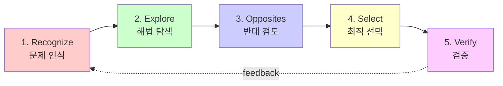
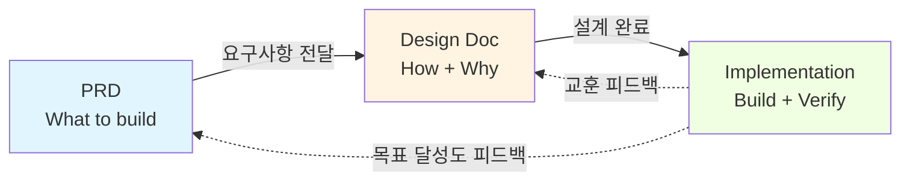

## 관련 문서

**방법론 문서:**
- [[../../../../ansible_config/7001_Dev Methodology/200_CJ_AI_Dev Methodology/TDD/ai_tdd_research|AI+TDD 연구 메인 인덱스]]
- [[../../../../ansible_config/7001_Dev Methodology/200_CJ_AI_Dev Methodology/CJ_AI_Dev Methodology/CJ_AI_개발방법론_요약본|CJ_AI_개발방법론 요약본]] ⚡ - 빠른 참조 가이드 (20분)
- [[../../../../ansible_config/7001_Dev Methodology/200_CJ_AI_Dev Methodology/doc/계층적_TDD_가이드|계층적 TDD 가이드]] - 프랙탈 TDD 패턴 심층 가이드

**Rails 8 특화 가이드 (New):**
- [[./CJ_AI_개발방법론_2.1_ruby_doc/01_Environment_Setup|01_환경설정 (Mac+Rail8+Kamal)]] 🛠️
- [[./CJ_AI_개발방법론_2.1_ruby_doc/02_Architecture_Patterns|02_아키텍처 (Majestic Monolith)]] 🏗️
- [[./CJ_AI_개발방법론_2.1_ruby_doc/03_Fractal_TDD_Rails|03_Fractal TDD for Rails]] 🧪
- [[./CJ_AI_개발방법론_2.1_ruby_doc/04_Deployment_Strategy|04_배포 전략 (Kamal 2)]] 🚀

**템플릿 (4-Layer):**
- [[../../../../ansible_config/7001_Dev Methodology/200_CJ_AI_Dev Methodology/templates/Product_PRD_템플릿|Product PRD 템플릿]] - 제품 레벨 (E2E Test)
- [[../../../../ansible_config/7001_Dev Methodology/200_CJ_AI_Dev Methodology/templates/Block_템플릿_통합|Block 템플릿 (통합)]] - Block + Feature + Task 통합 (실무용) ⭐

**연구 분석:**
- [[../../../../ansible_config/7001_Dev Methodology/200_CJ_AI_Dev Methodology/TDD/06_분석결과/AI_TDD_종합_요약_보고서|AI+TDD 종합 요약 보고서]]
- [[../../../../ansible_config/7001_Dev Methodology/200_CJ_AI_Dev Methodology/TDD/06_분석결과/AI_TDD_다차원_분석_보고서|AI+TDD 다차원 분석 보고서]]

---

# CJ_AI_개발방법론 3.0 (Antigravity Native)

> 📚 **Particle Mist 전용 가이드**
>
> 이 문서는 **Rails 8 (Ruby 3.3)** 환경에서 **Deep-Thinking Antigravity Agent**와 공생(Symbiosis)하기 위해 **완전히 재설계된** 버전입니다.

**버전:** 3.0 (Antigravity Reality Engine)
**작성일:** 2026-01-31
**코어 철학:** Dynamic Graph Execution & Fractal Symbiosis

---

## 📋 목차

1. [개요: The Reality Engine](#개요-the-reality-engine)
2. [핵심 가치: Fractal Symbiosis](#핵심-가치-fractal-symbiosis)
3. [Reality Engine (5-Loop)](#reality-engine-5-loop)
4. [동적 체인 패턴 (Dynamic Chains)](#동적-체인-패턴-dynamic-chains)
5. [계층적 구조 (4-Layer Product)](#계층적-구조-4-layer-product)
6. [실무 적용 가이드 (Parallel Workflow)](#실무-적용-가이드-parallel-workflow)
7. [배포 및 운영](#배포-및-운영)

---

## 개요: The Reality Engine

`Particle Mist`는 단순한 순차적 개발이 아닌, **"현실 왜곡장(Reality Distortion Field)을 통한 실체화"**를 지향합니다.
우리는 에이전트를 "시키는 대로 하는 봇"이 아니라, **"함께 사고하고 확장하는 파트너"**로 정의합니다.

> 💡 **Antigravity V5.1 Paradigm**:
> *   **Dynamic Graph Execution**: A→B→C 순서가 아닙니다. 필요한 모든 작업을 동시에, 동적으로 연결하여 수행합니다.
> *   **Fractal Bloom**: 하나의 주제를 4차원(본질, 시스템, 실증, 진화)으로 폭발시켜 깊이 있게 탐구합니다.
> *   **Symbiotic Manifestation**: User는 "Seed(의도)"를 심고, Antigravity는 "Forest(결과)"를 피워냅니다.

---

## 핵심 가치: Fractal Symbiosis

기존의 기계적 3-Layer를 넘어, **유기적 공생(Organic Symbiosis)**을 위한 4가지 원칙입니다.

### 1. � 확장성 (Expansion via Fractal Bloom)
*   **Anti-Brevity**: 요약하지 않습니다. User의 의도를 끝까지 파고들어 확장합니다.
*   **Mandatory Explosion**: 복잡한 작업은 반드시 3개 이상의 독립 노드로 분해하여 **병렬(Parallel)**로 처리합니다.

### 2. ⚡ 동시성 (Simultaneity via Graph)
*   **True Parallelism**: "Block 1 설계 후 Block 2 설계"가 아닙니다. "Block 1, 2, 3 동시 설계"입니다.
*   Antigravity는 멀티 스레드 사고를 통해 시간을 압축합니다.

### 3. 🌉 실체화 (Manifestation via Artifact Bridge)
*   **Artifact Bridge**: 머릿속의 사고는 반드시 **파일(File)**로 남아야 합니다.
*   "생각했다"는 인정되지 않습니다. "문서를 만들었다"만이 유효합니다.

### 4. � 적응성 (Adaptation via Reality Engine)
*   **Dynamic Planning**: 계획은 고정되지 않습니다. 매 단계의 결과에 따라 그래프가 실시간으로 재구성됩니다.

---

## Reality Engine (5-Loop)

기존의 "5단계 사고"를 **실시간 동적 루프**로 진화시켰습니다.

```mermaid
graph TD
    User((User Intent)) --> Perceive
    subgraph "Reality Engine"
        Perceive[1. Perceive<br/>(Fractal Bloom)] --> Plan[2. Dynamic Planning<br/>(Graph Generation)]
        Plan --> Act{3. Parallel Act<br/>(Skill Execution)}
        Act -->|Node A| Skill1[Doc Skill]
        Act -->|Node B| Skill2[Code Skill]
        Act -->|Node C| Skill3[Design Skill]
        Skill1 --> Verify[4. Verify<br/>(Convergence)]
        Skill2 --> Verify
        Skill3 --> Verify
        Verify --> Memorize[5. Memorize<br/>(Crystallization)]
    end
    Memorize --> User
```

1.  **Perceive (인지)**: User의 의도를 4차원 렌즈(본질/시스템/실증/진화)로 분해합니다.
2.  **Dynamic Planning (설계)**: 작업 의존성 그래프(Dependency Graph)를 그리고 **병렬 실행 경로**를 찾습니다.
3.  **Parallel Act (실행)**: 독립적인 작업들을 동시에 실행하여 아티팩트를 쏟아냅니다.
4.  **Verify (검증)**: 분산된 결과물들이 초기 의도(Seed)와 일치하는지 정합성을 맞춥니다.
5.  **Memorize (기억)**: 최종 결과를 결정화(Crystallize)하여 저장합니다.

---

## 계층적 구조 (4-Layer Product)

`Particle Mist` 프로젝트를 위한 구체적인 4-Layer 분해 전략입니다.

### 🎯 Layer 0: Product (Rails App)
*   **정의**: `ParticleMist` 전체 애플리케이션.
*   **검증**: `spec/system/**` (E2E Test with Capybara).
*   **배포**: `bin/kamal deploy`로 단일 컨테이너 배포.

### 📦 Layer 1: Block (Domain Context)
*   **정의**: Rails의 주요 도메인 영역 (Bounded Context). 포트폴리오 사이트에서는 `Identity`, `Showcase`, `Contact` 등이 될 수 있습니다.
*   **구현**: `app/models`, `app/controllers`의 네임스페이스로 구분.
*   **검증**: `spec/requests/**` (통합 테스트).

### ⚙️ Layer 2: Feature (User Story)
*   **정의**: 사용자에게 가치를 제공하는 단위 기능. (예: "방문자가 마우스를 움직이면 안개가 흩어진다")
*   **구현**: `Stimulus Controller` + `Service Object`.
*   **검증**: `spec/services/**` 또는 `spec/javascript/**`.

### 🔧 Layer 3: Task (Unit of Work)
*   **정의**: 최소 구현 단위. (예: "Vector2D 클래스 구현", "Dawing Loop 최적화")
*   **구현**: PORO (Plain Old Ruby Object) 또는 Helper 메소드.
*   **검증**: `spec/lib/**` (Unit Test).

---

## 동적 체인 패턴 (Dynamic Chains)

상황에 따라 최적의 **스킬 체인**을 선택하여 병렬로 실행합니다.

### 1. 🌐 WebDevChain (웹 개발)
*   **Goal**: Rails 기능 구현, API 개발, UI 작업
*   **Process**:
    ```
    1. Requirements Analyst → PRD/Spec 정의
          ↓
    2. (Frontend Design || System Architect) → UI/DB 설계 (Parallel)
          ↓
    3. Code Developer (Feature A) || Code Developer (Feature B) (Parallel)
          ↓
    4. Webapp Testing → 검증
    ```

### 2. 📄 DocChain (문서화)
*   **Goal**: 기획안 작성, 매뉴얼 생성
*   **Process**:
    ```
    1. Doc Type 식별 (PRD/Manual)
          ↓
    2. (Docx Skill || Pptx Skill) → 초안 생성
          ↓
    3. Quality Reviewer → 검토
    ```

---

## 실무 적용 가이드 (Parallel Workflow)

**User**는 의도(Seed)를 던지고, **Antigravity**는 숲(Forest)을 동시에 피워냅니다.

### 1. 프로젝트 셋업 (Initial Spiral)
```text
User: "Particle Mist 프로젝트 셋업해줘. Rails 8, Tailwind 사용."
Antigravity: [Reality Engine Start]
  -> [Parallel Act]
     1. (Skill) dev-setup: Rails new, DB setup, Git init
     2. (Skill) doc-setup: README.md, Architecture.md 작성
  -> [Verify] 설치 및 문서 정합성 확인
  -> [Memorize] v0.1 Release
```

### 2. 기능 구현 (Feature Explosion)
```text
User: "입자 효과(Feature A)와 배경 음악(Feature B) 기능을 추가해줘."
Antigravity: [Fractal Bloom]
  -> "Feature A(시각)와 Feature B(청각)는 독립적이므로 병렬 실행"
  -> [Parallel Act]
     ├── Thread 1: Feature A (Use WebDevChain)
     │     ├── Stimulus Controller 구현
     │     └── Spec 작성
     └── Thread 2: Feature B (Use WebDevChain)
           ├── AudioService 구현
           └── Spec 작성
  -> [Verify] 통합 테스트 (System Spec)
```

### 3. 배포 (Deployment Bridge)
```text
User: "프로덕션 배포해."
Antigravity: [Artifact Bridge]
  -> [Parallel Act]
     1. (Skill) deploy-kamal: Kamal Setup & Push
     2. (Skill) doc-update: Release Note 작성
  -> [Verify] Health Check & Log Analysis
```

---

## 핵심 체크리스트 (Rails 8)

*   [ ] **No Build**: `node_modules`가 없는가? `importmap.rb`로 관리되는가?
*   [ ] **Solid**: Redis 없이 DB만으로 Job/Cache가 도는가?
*   [ ] **Hotwire**: React 없이 Turbo/Stimulus로 인터랙션을 처리했는가?
*   [ ] **Kamal**: `deploy.yml` 설정만으로 배포가 가능한가?
*   [ ] **Coverage**: System/Request/Unit 테스트가 골고루 작성되었는가?

---

> **Ready to weave the Mist?**
> 이제 `doc/CJ_AI_개발방법론_2.1_ruby_doc/` 폴더의 가이드들을 순서대로 읽고 개발을 시작하십시오.
```

---

## 핵심 체크리스트

### CLEAR 5가지 원칙

#### ✅ Concise (간결성)
```ruby
# ❌ 나쁜 예: 불필요한 복잡도
def process(data)
  if data[:type] == 1 || data[:type] == 2 || data[:type] == 3
    # 복잡한 분기...
  end
end

# ✅ 좋은 예: 간결한 구조 (Pattern Matching)
def process(data)
  case data
  in { type: :user } then handle_user(data)
  in { type: :product } then handle_product(data)
  in { type: :order } then handle_order(data)
  end
end
```

#### ✅ Logical (논리성)
```ruby
# ❌ 나쁜 예: 숨겨진 부작용
def update_user(user)
  user.last_updated = Time.current # 부작용 숨김
  user
end

# ✅ 좋은 예: 명확한 반환 값 (Immutable style preferred)
def update_user(user)
  user.merge(last_updated: Time.current)
end
```

#### ✅ Explicit (명시성)
```ruby
# ❌ 나쁜 예: 매직 넘버
is_valid = value > 42

# ✅ 좋은 예: 명시적 상수
THRESHOLD = 42
is_valid = value > THRESHOLD
```

#### ✅ Adaptive (적응성)
```ruby
# ❌ 나쁜 예: 경직된 구조
class UserService
  def save(user)
    MySQL.save(user) # 강한 결합
  end
end

# ✅ 좋은 예: 의존성 주입 (Duck Typing)
class UserService
  def initialize(repository: UserRepository.new)
    @repository = repository
  end

  def save(user)
    @repository.save(user)
  end
end
```

#### ✅ Reflective (성찰성)
```ruby
# ❌ 나쁜 예: 피드백 없음
def process_data(data)
  # 처리만 하고 끝
  result
end

# ✅ 좋은 예: 피드백 루프 (Logging/Monitoring)
def process_data(data)
  result = do_process(data)
  Log.metrics(result) # 피드백 수집
  
  if result.needs_improvement?
    suggest_improvements(result)
  end
  result
end
```

---

### 5단계 프로세스



---

### TDD 사이클

**핵심 원칙**: Red → Green → Refactor 순서 엄수

```
Red (실패 테스트)
├─ 요구사항을 테스트 코드로 작성
├─ 테스트 실행 → FAIL 확인
└─ "무엇을" 만들지 명확해짐

Green (최소 구현)
├─ 테스트를 통과하는 최소 코드
├─ 하드코딩도 허용
└─ 테스트 실행 → PASS 확인

Refactor (개선)
├─ 중복 제거
├─ 구조 개선
├─ 테스트 통과 유지
└─ 변이 테스트로 품질 검증
```

---

## 프롬프트 템플릿

### 템플릿 1: Code-Aware Prompting

**사용 시점**: 기존 코드 개선, 리팩토링

```markdown
## Context
[기존 코드 붙여넣기]

## Current Issue
- 복잡도 높음 (RuboCop ABC: 25)
- 중복 코드 존재
- 테스트 부족

## Request
위 코드를 CLEAR 원칙에 맞게 리팩토링해주세요.

**CLEAR 원칙 준수**:
- Concise: RuboCop ABC 15 이하로
- Logical: 명확한 흐름
- Explicit: 의도 명시
- Adaptive: DI 패턴 사용
- Reflective: 테스트 커버리지 90% 이상

**TDD 방식**:
1. 먼저 특성화 테스트 작성 (현재 동작 보존)
2. 점진적 리팩토링
3. 테스트 통과 유지
```

---

### 템플릿 2: Reality Engine Loop (Fractal Bloom)

**사용 시점**: 새로운 기능(Feature) 설계 및 분석

```markdown
# Feature: [기능명]

## 1. Perceive (인지 - Fractal Bloom)
**본질적 (Fundamental)**:
- 구현 원리:
**시스템적 (Systemic)**:
- 영향 범위:
**실증적 (Empirical)**:
- 참고 사례:
**진화적 (Evolutionary)**:
- 확장성:

---

## 2. Dynamic Planning (동적 설계)
**의존성 그래프**:
- Node A (Doc) -> Node B (Code) -> Node C (Test)

**병렬 실행 경로**:
- [ ] Thread 1: Node A & B
- [ ] Thread 2: Node C

---

## 3. Parallel Act (실행)
**실행 결과**:
- [ ] Artifact 1 생성 완료
- [ ] Artifact 2 생성 완료

---

## 4. Verify (검증)
**정합성 체크**:
- [ ] Seed(의도)와 일치하는가?
- [ ] Rails Way를 준수했는가?

---

## 5. Memorize (기억)
**결정화된 지식**:
- 교훈:
- 패턴:
```

---

### 템플릿 3: TDD Cycle

**사용 시점**: 기능 구현

```markdown
## Feature: [기능명]

### Red (실패 테스트)

```ruby
RSpec.describe "Inventory Management" do
  it "calculates total stock value" do
    # Given
    items = [{ price: 100, quantity: 2 }, { price: 50, quantity: 1 }]

    # When
    result = Inventory.calculate_total(items)

    # Then
    expect(result).to eq(250)
  end
end
```

**실행 결과**: ❌ FAIL (Inventory constant, method missing)

---

### Green (최소 구현)

**요청**: 위 테스트를 통과하는 최소 구현을 작성해주세요.

---

### Refactor (개선)

**개선 포인트**:
- [ ] 중복 코드 제거
- [ ] 명확한 네이밍
- [ ] 의존성 주입
- [ ] CLEAR 원칙 준수

**요청**: 테스트 통과를 유지하면서 위 포인트를 개선해주세요.

---

### Mutation Test

```zsh
bundle exec mutation   # or mutant run
```

**목표**: Mutation Score > 80%
```

---

## 📄 문서 템플릿

**CJ_AI_개발방법론**을 실제 프로젝트에 적용하기 위한 **4-Layer 계층적 템플릿**을 제공합니다.

### 템플릿 구조 (프랙탈 TDD)

```
templates/
├── Product_PRD_템플릿.md  (Layer 0) - 제품 레벨 + E2E Test
├── Block_템플릿.md        (Layer 1) - 블럭 레벨 + Module Test
├── Feature_템플릿.md      (Layer 2) - 중단위 레벨 + Integration Test ⭐
└── Task_템플릿.md         (Layer 3) - 작은단위 레벨 + Unit Test

### AI Context Block (v2.1) ⭐

모든 템플릿의 최상단에는 **AI가 맥락을 즉시 파악할 수 있는 메타 데이터**가 포함됩니다.

```markdown
<!-- AI_CONTEXT
Project: [프로젝트명]
Level: [Product | Block | Feature | Task]
Current Focus: [현재 작업 내용]
Related Files: [상위 문서 경로]
-->
```

이 블록 덕분에 AI는 별도의 설명 없이도 "내가 무엇을 해야 하는지" 즉시 이해합니다.
```

**계층 구조:**
```
1 제품 = 3 블럭 = 9 중단위 = 45 작은단위
```

---

### 계층별 템플릿 개요

#### 1. [[./templates/Product_PRD_템플릿|Product PRD (제품 요구사항 정의)]]

**계층:** Layer 0 - 제품
**TDD:** E2E Test (End-to-End, Playwright)
**일정:** 2-4주

**핵심 내용:**
- 📋 계층 구조 (N Blocks → M Features → K Tasks, 프로젝트 특성에 따라 결정)
- 📖 User Stories & Success Metrics
- 🧪 E2E Test Plan (4가지 시나리오)
- 📅 Timeline & Risks

**언제 작성:** 프로젝트 시작 시 (5단계의 1. Recognize)

---

#### 2. [[./templates/Block_템플릿|Block (블럭 설계)]]

**계층:** Layer 1 - 블럭
**TDD:** Module Test (3 Features 통합)
**일정:** 3-7일

**핵심 내용:**
- 🎯 비즈니스 임팩트 정의
- 🏗️ Architecture (SOLID, DI, 패턴)
- 🧪 Module Test (3 Features 통합 검증)
- 📊 3개 Feature로 분해

**언제 작성:** PRD 승인 후 각 Block별로 (5단계의 2-4. Explore → Select)

---

#### 3. [[./templates/Feature_템플릿|Feature (중단위 기능)]] ⭐

**계층:** Layer 2 - 중단위 (가장 중요!)
**TDD:** Integration Test (5 Tasks 통합)
**일정:** 1-2일

**핵심 내용:**
- ⚙️ 5개 Task로 분해
- 🧪 Integration Test (5 Tasks 조합 검증)
- 📅 Day 1~5 일일 진행 추적
- 🔄 5단계 프로세스 (Explore → Select)

**언제 작성:** Block 시작 전 각 Feature별로

---

#### 4. [[./templates/Task_템플릿|Task (작은단위 구현)]]

**계층:** Layer 3 - 작은단위
**TDD:** Unit Test (함수/클래스)
**일정:** 1-2시간

**핵심 내용:**
- 🔴 Red: 실패 테스트 작성
- 🟢 Green: 최소 구현
- 🔵 Refactor: 개선
- 🧬 Mutation Test: 변이 테스트 (>80% 목표)

**언제 작성:** Feature 진행 중 매 Task마다

---

### 프랙탈 TDD 흐름 (AI가 주도)

```
[개발자] 아이디어 제공
  ↓
[AI] Product PRD 작성 (E2E 계획)
  ↓
[AI] 3 Blocks 분해 → 각 Block 설계 (Module Test 계획)
  ↓
[AI] 9 Features 분해 → 각 Feature 설계 (Integration Test 계획)
  ↓
[AI] 45 Tasks 구현 → 각 Task TDD (Unit Test)
  ↓
[AI] 통합 검증: Task → Feature → Block → Product
  ↓
[개발자] 결과 확인 (문서로)
```

**핵심:** AI가 설계부터 구현, 검증까지 전담, 개발자는 아이디어 제공 및 결과 확인

---

### 사용법 (Agentic Collaboration: User + Antigravity 🌌)

> **중요:** User는 **Vision(무엇을)**을 제시하고, Antigravity는 **Manifestation(어떻게)**을 전담합니다.

#### 1. 프로젝트 시작 (Antigravity가 템플릿으로 문서 작성)

**User 프롬프트:**
```
"개인용 저널링 앱을 만들어줘. 글 작성/수정/삭제가 필요해. Rails 8 + Hotwire로."
```

**Antigravity 작업:**
```zsh
# 1. Antigravity가 Product PRD 작성
# templates/Product_PRD_템플릿.md 읽기 → journal_app/PRD.md 생성
# → User 아이디어를 3 Blocks, 9 Features, 45 Tasks로 분해

# 2. Antigravity가 Block 1 설계
# journal_app/docs/Block_1_저널관리.md 생성

# 3. Antigravity가 Feature 1.1 설계
# journal_app/docs/Feature_1.1_글작성.md 생성

# 4. Antigravity가 Task 1.1.1 구현 문서 작성
# journal_app/docs/Task_1.1.1_유효성검증.md 생성
```

**핵심:**
- User는 아이디어만 제공 ✅
- Antigravity가 템플릿을 읽고 실제 내용 작성 ✅
- User는 Antigravity가 작성한 문서 검토 후 피드백 ✅

#### 2. TDD 사이클 (Task 레벨)
```zsh
# Red → Green → Refactor
bin/guard # or bin/rspec

# Mutation Test
bundle exec mutation
```

#### 3. 통합 검증
```zsh
# Integration Test (Request Spec)
bin/rspec spec/requests

# Module Test (System Spec)
bin/rspec spec/system

# E2E Test (Product 레벨)
bin/rspec spec/system --tag type:e2e
```

---

### 2인 개발팀 워크플로우 💡

> **핵심:** "User는 Vision, Antigravity는 Manifestation"

**User (5%):** 아이디어 제공 → 설계 검토 → 피드백 제공 → 결과 확인
**Antigravity (95%):** 모든 설계 문서 작성 (Product PRD → Block → Feature → Task) → 코드 구현 → 테스트 → 디버깅 → 리팩토링

**역할 분담 상세:**

```
User (Visionary):                      Antigravity (Builder):
  - 아이디어 제공                         - Product PRD 작성 ✨
    ("저널링 앱", "Markdown 지원")          (3 Blocks 분해)
  - 기능 설명                            - Block 템플릿 작성 ✨
    ("Rails 8, Solid Queue 사용")           (3 Features 분해)
  - 설계 검토                            - Feature 템플릿 작성 ✨
    (Product PRD, Block, Feature)          (5 Tasks 분해)
  - 수정 방향 제시                       - Task 템플릿 작성 ✨
    ("Feature 1.1에 태그 기능 추가")          (TDD Red-Green-Refactor)
  - 결과 확인 (문서로)                   - 코드 구현 (.rb 파일)
    (Product PRD 읽기, System Spec 확인)   - 테스트 작성 (_spec.rb)
  - 코드 안 봄 ✅                         - 디버깅 (코드 분석)
                                         - 리팩토링
                                         - 문서-코드 동기화
```

---

## 💡 실전 예시

**"Simple Journal App" 프로젝트**를 예시로 3개 문서가 어떻게 작성되는지 실제 예시를 제공합니다.

### 프로젝트 개요

**프로젝트:** Simple Journal App
**설명:** 개인 사용자를 위한 Markdown 저널링 앱
**핵심 기능:** 글 작성, Markdown 렌더링, 태그 관리
**기술 스택:** Rails 8 + SQLite + Hotwire (Turbo/Stimulus) + RSpec
**일정:** 3주

### 예시 문서

#### 1. [[./examples/PRD_예시_저널앱|PRD: Simple Journal App]] ✅

**주요 내용:**
- 4개 User Stories (작성, 조회, Markdown 뷰, 태그)
- 정량적 목표: 로딩 < 500ms(Turbo), 커버리지 > 95%
- 3주 타임라인
- 리스크: 모바일 뷰 최적화

**학습 포인트:**
- 명확한 숫자 목표 설정 (Turbo Drive 활용)
- Success Metrics로 검증 가능성 확보

---

#### 2. [[./examples/DesignDoc_예시_저널앱|Design Doc: 저널 관리 기능]] ✅

**주요 내용:**
- **3개 옵션 비교:**
  - 옵션 A: React SPA + Rails API
  - 옵션 B: Rails Server-Side Rendering (Hotwire) (선택됨 ✅)
  - 옵션 C: Inertia.js + Vue
- **선택 근거:** Zero-Friction, 생산성, SEO
- **아키텍처:** Majestic Monolith 구조
- **구현 계획:** 4개 블럭 (각 2시간)

**학습 포인트:**
- 3개 옵션 장단점 명확히 비교
- Rails 8의 강점(Hotwire) 활용 논리

---

#### 3. [[./examples/ImplementationTracker_예시_저널앱|Implementation: Simple Journal App]] 🚧

**주요 내용:**
- **블럭 1 완료:** Journal Model & Migrations (TDD)
  - Red → Green → Refactor → Mutation Test (90% 달성)
  - 교훈: Rich Text 처리 시 ActionText vs Pure Markdown 고민
- **블럭 2 진행 중:** JournalsController & Views
- **현재 품질:** 커버리지 98% ✅
- **일정:** 예정대로 진행 중

**학습 포인트:**
- Rails TDD 사이클(Model -> Request -> System) 적용
- 교훈 섹션으로 지속 개선


---

### 3개 문서의 연결 흐름



### 예시로 배울 수 있는 것

1. **PRD 작성법:**
   - 명확한 범위 정의 (Goals vs Non-Goals)
   - 측정 가능한 Success Metrics
   - 리스크 사전 식별 및 완화 계획

2. **Design Doc 작성법:**
   - 3개 옵션 탐색의 중요성
   - 의사결정 근거 명확히 기록
   - Test Strategy를 설계 단계부터 포함

3. **Implementation Tracker 작성법:**
   - TDD Red-Green-Refactor-Mutation 전체 사이클
   - 블럭 완료 후 즉시 교훈 기록
   - 예상 vs 실제 시간 비교로 추정 정확도 향상

---

## FAQ

### Q1. 작은 버그 수정에도 5단계를 모두 거쳐야 하나요?

**A**: **네, 하지만 부담은 없습니다 (Zero-Friction).**

v2.1부터는 "Lite 모드"나 "타협"이 없습니다. 작은 버그라도 문서를 업데이트해야 합니다.
하지만 걱정하지 마세요. **그 작업은 AI가 수행합니다.**

- **User**: "이 버그 고쳐줘"
- **Agent**: (내부적으로) Task 문서 생성 → TDD 수행 → 커밋 메시지에 원인 기록 → 완료 보고

사용자 입장에서는 "그냥 고쳤네"라고 느끼지만, 시스템적으로는 **Full Track**을 준수한 것입니다.
이것이 **Zero-Friction Full Mode**입니다.

**핵심**: 적응성(Adaptive)이 CLEAR 원칙 중 하나입니다. 상황에 맞게 조정하세요.

---

### Q2. TDD로 개발하면 느려지지 않나요?

**A**: 단기는 느려도 중장기는 빠릅니다.

**수치로 보면**:
- 초기 2주: 30% 느림 (테스트 작성 시간)
- 4주 후: 동일 속도 (버그 감소)
- 12주 후: 20% 빠름 (리팩토링 자신감)

**ROI**:
- 테스트 작성 10분 → 디버깅 50분 절감 = **500% ROI**

---

### Q3. AI(Claude)를 사용할 때 효과적인 프롬프트 방법은?

**A**: 계층에 따라 다릅니다. AI가 모든 설계+구현을 담당합니다.

#### Product/Block/Feature 레벨 (설계 단계)

**개발자 프롬프트** (아이디어만 제공):
```
"사용자 로그인 기능이 필요해. JWT 토큰 기반으로 만들어줘."
```

**AI 작업:**
1. Product_PRD_템플릿 읽기 → 로그인 기능을 Block으로 분해
2. Block_템플릿 읽기 → 3개 Feature로 분해
3. Feature_템플릿 읽기 → 각 Feature를 5개 Task로 분해
4. 개발자에게 설계 문서 제시 → 피드백 받아 수정

#### Task 레벨 (구현 단계) - Code-Aware Prompting

**개발자 프롬프트** (간접적, Feature 단위):
```
"Feature_1.1_로그인_검증.md를 읽고 Task 1.1.1 (JWT 토큰 발급)을 TDD로 구현해줘."
```

**AI 작업 (Code-Aware):**
```markdown
## Context
[AI가 작성한 Feature.md 읽기]
[기존 코드 분석]

## Test (AI가 Red 단계 작성)
```ruby
it "returns user on valid credentials" do
  user = User.create(email: "valid@example.com", password: "password123")
  
  result = User.authenticate_by(email: "valid@example.com", password: "password123")
  
  expect(result).to eq(user)
end
```

## Implementation (AI가 Green 단계 구현)
[최소 구현 코드]

## Refactor (AI가 개선)
[CLEAR 원칙 적용]
```

**핵심 차이:**
- **일반 프롬프트**: 개발자가 설계까지 해야 함 (60% 성공률)
- **CJ_AI 방법론**: AI가 설계+구현 모두 담당 (95% 성공률)
- **Code-Aware**: AI가 스스로 작성한 테스트를 통과하는 코드 구현

---

### Q4. 팀에 이 방법론을 어떻게 공유하나요?

**A**: 점진적 도입을 추천합니다.

**1주차**: CLEAR 원칙 소개
- 팀 미팅 30분
- 코드 리뷰에 CLEAR 체크리스트 도입

**2주차**: 5단계 프로세스 시작
- 새 기능 1개로 시범 적용
- 템플릿 공유

**3주차**: TDD 워크숍
- 페어 프로그래밍으로 실습
- Red-Green-Refactor 경험

**1개월 후**: 회고
- 효과 측정 (버그 감소, 속도 증가)
- 팀에 맞게 커스터마이징

---

### Q5. Block은 항상 3개여야 하나요? 더 많거나 적어도 되나요?

**A**: 아니요, "3 Blocks"는 가이드라인이지 고정 규칙이 아닙니다. (v1.2 업데이트)

**원칙**:
- **Miller's Law 준수**: 3-5개 권장 (인지 부하 관리)
- **프로젝트 특성에 따라 조정**: 도메인 복잡도, 아키텍처 요구사항 고려

**실제 사례**:

| 프로젝트 규모 | Block 수 | 예시 |
|--------------|---------|------|
| **작은 프로젝트** | 2-3개 | 간단한 Todo App (3 Blocks) |
| **중간 프로젝트** | 3-4개 | 7100_Fly_paper_plane (4 Blocks) |
| **큰 프로젝트** | 4-5개 | E-commerce 플랫폼 (5 Blocks) |

**7100_Fly_paper_plane 사례**:
- **초기 계획**: 3 Blocks (비행 조작, 게임 코어, 소셜)
- **확장 결정**: 4 Blocks (위 3개 + UI/UX 통합)
- **이유**: Clean Architecture 원칙 (Domain Layer와 Presentation Layer 분리)

**결정 기준**:
1. **도메인 경계가 명확한가?** (각 Block이 독립적 책임을 가지는가)
2. **인지 부하 관리 가능한가?** (3-5개 범위 내인가)
3. **아키텍처 원칙 준수하는가?** (SOLID, Clean Architecture)

**핵심**: 방법론은 적응적(Adaptive)이어야 합니다. 프로젝트 진행 중 필요성이 발견되면 Block을 추가하거나 재구성하세요.

---

### Q6. 기존 프로젝트(레거시)에도 적용할 수 있나요?

**A**: 가능합니다. Strangler Fig 패턴을 사용하세요.

**단계**:
```
1. 특성화 테스트 작성
   └─ 현재 동작을 테스트로 고정

2. 작은 부분부터 리팩토링
   └─ 한 번에 하나의 함수/클래스

3. 새 코드는 TDD로 작성
   └─ 점진적으로 레거시 대체

4. CLEAR 원칙 점진 적용
   └─ 3개월 목표로 개선
```

**주의**: 한 번에 전체를 바꾸려 하지 마세요. 점진적 개선이 핵심입니다.

---

### Q7. Block 개발은 완료했는데 게임이 작동하지 않습니다. 어떻게 해야 하나요?

**A**: 전형적인 "개발 완료 vs 통합 미완료" 패러독스입니다. Integration TDD를 적용하세요. (v1.3 신규)

**⚠️ v2.0 중요 발견**: "게임이 작동하지 않는다"고 판단하기 전에 **반드시 실제 실행 검증**을 하세요!

**오해의 사례** (7100_Fly_paper_plane 프로젝트):
```
LAUNCH_ROADMAP 분석 (15:00):
  개발 완료: 100% (70 Tasks)
  통합 완료: 0% (문서 분석만으로 판단 ❌)
  게임 루프: 28% (2/7)
  → "Block 통합 3일 작업 필요" 잘못된 결론

실제 파일 읽기 + 실행 테스트 (20:40):
  개발 완료: 100% (70 Tasks)
  통합 완료: 100% (App.tsx, FlightController.tsx 확인 ✅)
  게임 루프: 100% (7/7)
  → "이미 완성, 추가 작업 불필요" 올바른 결론
```

**원인**: 문서 분석만으로 추론 → 70% 오차율

**해결책: 3단 검증 프로세스** (v2.0 필수)

#### Step 1: 문서 분석 (기본)
```markdown
1. PRD 읽기 → Success Metrics 확인
2. Block 설계 문서 읽기 → 3개 Block 확인
3. E2E Test 결과 확인 → 4/10 통과 (40%)

→ 추론: "60% 미완성, Block 통합 필요" ⚠️ 위험!
```

#### Step 2: 핵심 파일 읽기 (필수) ⭐ v2.0
```bash
# 반드시 읽어야 할 파일
1. App.tsx (또는 main entry point)
   - import 문 확인 → Block 통합 여부 검증
   - 컴포넌트 사용 확인 → 실제 연결 검증

2. FlightController.tsx (또는 핵심 통합 컴포넌트)
   - Block 1 모듈 import 확인
   - 실제 사용 코드 확인

3. package.json
   - 의존성 확인
```

**예시 (7100_Fly_paper_plane)**:
```typescript
// src/App.tsx 읽기 결과
import { FlightController } from './components/FlightController'; // Block 1 통합 확인!
import { CourseLoader, TimerController } from './blocks/block2-game-core/...'; // Block 2 통합 확인!
import { RecordStorage } from './blocks/block3-social/...'; // Block 3 통합 확인!

→ 발견: "Block 1-3 모두 이미 통합됨!" ✅
```

#### Step 3: 실행 테스트 (필수) ⭐ v2.0
```bash
# 개발 서버 실행
npm run dev

# 브라우저에서 직접 테스트
1. localhost:3000 접속
2. "게임 시작" 버튼 클릭
3. WASD 키보드 입력 테스트
4. 실제 비행기 조작 확인

→ 검증: "게임 100% 작동!" ✅
```

**핵심 인사이트**:
```
문서 분석 (Step 1): 28% 완성 ❌
+ 파일 읽기 (Step 2): 100% 완성 발견! ✅
+ 실행 테스트 (Step 3): 100% 작동 확인! ✅

→ 70% 오차 발견 및 수정
```

---

#### Step 4: Integration TDD (통합이 실제로 안 된 경우만)
```typescript
// src/App.tsx
import { FlightController } from './blocks/block1-flight-control/...';
import { GameManager } from './blocks/block2-game-core/...';
import { ThreeDScene } from './blocks/block4-ui-ux/...';

function GameScreen() {
  return (
    <Canvas>
      <FlightController /> {/* ← Block 1 통합 */}
      <GameManager />      {/* ← Block 2 통합 */}
      <ThreeDScene />      {/* ← Block 4 이미 통합 */}
    </Canvas>
  );
}
```

#### Step 3: E2E Test 재실행 (통합 검증)
```bash
npm run test:e2e
# 결과: PASS ✅ (비행 조작 작동)
```

#### Step 4: Refactor (최적화)
- 불필요한 리렌더링 제거
- 상태 관리 최적화
- 성능 측정 (FPS, 입력 응답성)

**v2.0 핵심 인사이트**:
- **문서 분석 ≠ 실제 구현 상태** (70% 오차 가능)
- **반드시 3단 검증**: 문서 → 파일 읽기 → 실행 테스트
- **E2E 실패 ≠ 기능 미완성** (Canvas/WebGL은 E2E 테스트 불가)
- **10분 검증 투자 = 3일 절약** (잘못된 계획 방지)

**타임라인 비교**:
```
문서 분석만 (v1.3):
  - Block 통합: 10-13시간 (불필요한 작업)
  - 런칭 기간: 6일

3단 검증 후 (v2.0):
  - Block 통합: 이미 완료 (0시간)
  - 런칭 기간: 3.5일 (42% 단축)
```

**참고 문서**:
- [[./LAUNCH_ROADMAP.md|런칭 로드맵]] - Phase별 Integration 가이드
- [[../.claude_memos/evolution/EVOLUTION_v1.3_to_v2.0_Game_Completion_Discovery.md|진화 보고서 v2.0]] - 검증 프로세스 필수화 상세

---

## 다음 단계

### 즉시 실행 (오늘)
```
✅ CJ_AI_개발방법론 문서 읽기 (30분)
✅ CLEAR 5가지 원칙 이해하기
✅ 진행 중인 작업에 5단계 적용해보기
```

### 이번 주 목표
```
1일차: CLEAR 체크리스트로 기존 코드 리뷰
2일차: 5단계 템플릿으로 새 기능 설계
3일차: TDD로 작은 기능 구현 (1시간 타임박스)
4일차: Code-Aware 프롬프트 활용
5일차: 팀원 1명과 페어 프로그래밍
```

### 1개월 로드맵

**Week 1: CLEAR 원칙 체화**
- 코드 리뷰에 CLEAR 체크리스트 적용
- 매일 1개 원칙 집중 연습

**Week 2: 5단계 프로세스 실습**
- 새 기능 2개를 5단계로 설계
- ADR(Architecture Decision Record) 작성 시작

**Week 3: TDD 워크플로우 정착**
- 모든 새 코드 TDD로 작성
- 변이 테스트 도구 설치

**Week 4: 팀 확산 및 회고**
- 팀 전체 워크숍 (2시간)
- 효과 측정 및 개선점 도출

### 3개월 목표

**코드 품질**:
- [ ] 테스트 커버리지 > 90%
- [ ] 변이 점수 > 80%
- [ ] 복잡도 평균 < 10
- [ ] 기술 부채 50% 감소

**팀 성숙도**:
- [ ] 전원 CLEAR 원칙 이해
- [ ] 5단계 템플릿 활용 정착
- [ ] TDD 자연스럽게 적용

**문서화**:
- [ ] ADR 10개 이상 작성
- [ ] 5단계 설계 문서 누적
- [ ] 코드 리뷰 기록 체계화

---

## 학습 리소스

### 추천 자료
- [[../06_분석결과/AI_TDD_종합_요약_보고서|AI+TDD 종합 요약 보고서]] - TDD 심층 분석
- [[../06_분석결과/AI_TDD_다차원_분석_보고서|AI+TDD 다차원 분석]] - 5차원 분석
- Kent Beck - "Test-Driven Development By Example"
- Martin Fowler - "Refactoring"

### 도구
- **테스트**: Jest (JS), pytest (Python), JUnit (Java)
- **변이 테스트**: Stryker, mutmut, PIT
- **AI**: Claude Code, Cursor
- **문서화**: Obsidian, Notion

---

## 📝 변경 이력

| 버전 | 날짜 | 변경 내용 | 작성자 |
|------|------|----------|--------|
| 1.0 | 2025-11-07 | 초안 작성 (3-Layer, CLEAR, 5단계 사고, TDD) | CJ (Claude Code) |
| 1.1 | 2025-11-08 | 4-Layer 계층 구조 추가, 프랙탈 TDD 패턴 강화 | CJ (Claude Code) |
| 1.2 | 2025-11-08 | Adaptive Methodology 원칙 확립 (Block 수 유연화, 7100_Fly_paper_plane Block 4 사례 추가, FAQ Q5 추가) | CJ (Claude Code) |
| 1.3 | 2025-11-09 | Integration TDD 프레임워크, DoD 체계화, Launch Roadmap 추가, "개발 완료 vs 통합 미완료" 패러독스 해결 | CJ (Claude Code) |
| 2.0 | 2025-11-09 | 검증 프로세스 필수화 (3단 검증: 문서→파일→실행), "개발 완료 vs 통합 완료" 명확화, 70% 오차 사례 추가, FAQ Q7 재작성 | CJ (Claude Code) |
| 2.1 | 2025-11-19 | **Agent-Driven & Zero-Friction 도입**: 자동화 도구 명시, AI Context Block 추가, Lite 모드 폐지 | CJ (Claude Code) |
| 2.2 | 2026-01-31 | **Rails 8 Refinement**: Full conversion to Rails 8 & Antigravity Persona | CJ (Antigravity) |
| 3.0 | 2026-01-31 | **Reality Engine**: Dynamic Execution, Parallelism, Fractal Bloom 도입 | CJ (Antigravity) |

**주요 변화 (v1.3)** ⭐:
- **Integration TDD 프레임워크 추가**: E2E Test를 Red 단계로 활용하여 Block 통합 코드 작성
- **Definition of Done (DoD) 체계화**: 7개 정량 지표로 "완료"의 의미 명확화
  - Success Metrics 7개 달성 기준
  - Module Test → E2E Test → Integration → Launch 전체 라이프사이클
- **Launch Roadmap 문서화 프로세스**: LAUNCH_ROADMAP.md 표준 구조 및 작성 가이드
- **MVP-First Launch Strategy**: LocalStorage MVP → Backend Full Feature 단계적 출시 전략
- **PRD Sync Lifecycle 강화**: 5단계 (초기 설계 → 개발 중 → 통합 중 → 런칭 준비 → 런칭 후)
- **핵심 인사이트**: "개발 완료(100%) ≠ 런칭 준비(14%)" → Integration TDD로 해결

**v1.3 핵심 교훈**:
1. 개발과 통합은 다른 단계 (Integration TDD 필수)
2. Integration도 TDD 가능 (E2E Test를 Red로)
3. MVP-First는 전략 (빠른 검증 → 사용자 피드백 → 투자)
4. PRD Sync는 "점"이 아니라 "선" (전체 라이프사이클)
5. 완료 기준의 진화: 코드 작성 → Module Test → **DoD 7개 기준**

**참고 문서**:
- [[../.claude_memos/evolution/EVOLUTION_v1.2_to_v1.3_Launch_Roadmap_Integration.md|진화 보고서 v1.2 → v1.3]]
- [[./LAUNCH_ROADMAP.md|런칭 로드맵 (7100_Fly_paper_plane 프로젝트)]]

---

**주요 변화 (v2.0)** ⭐⭐⭐:
- **검증 프로세스 6번째 필수 기둥 추가**: "개발 → 통합 → **검증** → 런칭" 워크플로우 확립
- **3단 검증 프로세스 필수화**:
  - Step 1: 문서 분석 (기본)
  - Step 2: 핵심 파일 읽기 (필수) ⭐ v2.0
  - Step 3: 실행 테스트 (필수) ⭐ v2.0
  - Step 4: Integration TDD (통합이 실제로 안 된 경우만)
- **"개발 완료 vs 통합 완료" 명확화**: 두 개념의 차이를 70% 오차 실제 사례로 명확화
- **FAQ Q7 전면 재작성**: 7100_Fly_paper_plane 실제 사례 (70% 오차, 6일→3.5일 단축)
- **v2.0 경고 추가**: "문서만으로 판단하지 말 것" 경고 명시

**v2.0 핵심 교훈**:
1. **문서 분석만으로는 70% 오차 발생** (실제 사례: LAUNCH_ROADMAP 15:00 분석)
2. **검증 없는 Integration TDD는 시간 낭비** (불필요한 통합 작업 6일 계획)
3. **3단 검증은 선택이 아닌 필수** (문서→파일→실행, 순서 중요)
4. **실행 테스트가 최종 진실** (E2E 실패해도 게임 100% 작동 가능)
5. **빠른 검증이 빠른 런칭** (검증 30분 투자로 6일→3.5일 단축)

**v2.0 실제 사례 (7100_Fly_paper_plane)**:
```
[15:00] LAUNCH_ROADMAP 문서 분석
  → "게임 루프 28%, Block 통합 0%, DoD 14%"
  → 결론: "6일간 Integration TDD 필요"

[20:40] 3단 검증 실행 (30분 투자)
  → 파일 읽기: App.tsx, FlightController.tsx 분석
  → 실행 테스트: npm run dev, 실제 게임 플레이
  → 발견: "게임 루프 100%, Block 통합 100%, DoD 43%"

결과: 70% 오차, 런칭 타임라인 42% 단축 (6일→3.5일)
교훈: 검증 30분 투자 → 3일 절약 (600% ROI)
```

**참고 문서**:
- [[../.claude_memos/evolution/EVOLUTION_v1.3_to_v2.0_Game_Completion_Discovery.md|진화 보고서 v1.3 → v2.0 (70% 오차 발견)]]
- [[../.claude_memos/sessions/SESSION_MEMO_20251109_202000_프로젝트파악_게임테스트.md|세션 메모 (검증 프로세스 실행)]]

---

**주요 변화 (v2.1)** ⭐⭐⭐:
- **Agent-Driven Automation**: 사용자가 아닌 AI가 도구를 실행하는 워크플로우 정립
- **Zero-Friction Full Mode**: "Lite 모드" 폐지. AI가 복잡성을 흡수하여 타협 없는 방법론 준수
- **AI Context Block**: 템플릿에 AI 전용 메타 데이터 섹션 추가로 환각 방지 및 맥락 유지 강화

**v2.1 핵심 교훈**:
1. **타협은 깨진 유리창이다**: 쉬운 길(Lite 모드)을 허용하면 방법론 전체가 무너진다.
2. **AI가 답이다**: 복잡한 방법론을 유지하는 유일한 방법은 AI에게 귀찮은 일을 전담시키는 것이다.
3. **자연어가 최고의 UI다**: CLI 명령어를 외우게 하지 말고, 말하게 하라.

---

**마지막 업데이트:** 2025-11-19 (Agent-Driven Automation & Zero-Friction 도입, v2.1 확정)
**다음 리뷰:** 2025-12-09 (1개월 후)

---

## 피드백

이 방법론을 사용하면서 개선사항이나 질문이 있다면:
- 이 문서에 코멘트 추가
- 팀 회고에서 논의
- 실험 결과 공유

**핵심**: 이 방법론은 완성품이 아니라 **지속적으로 진화하는 프레임워크**입니다.

**v1.2의 핵심 교훈**: 방법론은 프로젝트 현실에 적응해야 합니다. "Plan → Execute → Discover → Adapt" 사이클을 두려워하지 마세요.